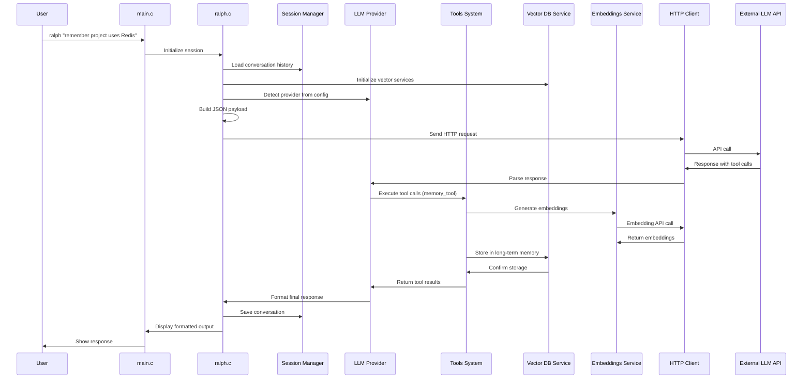
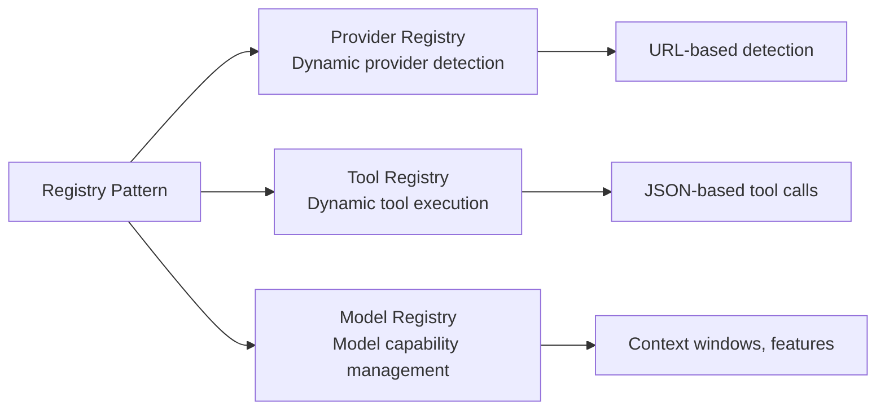
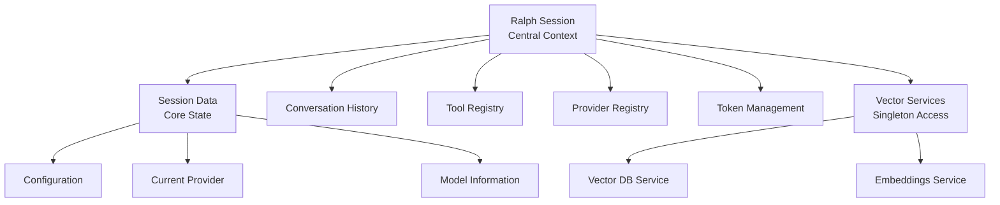
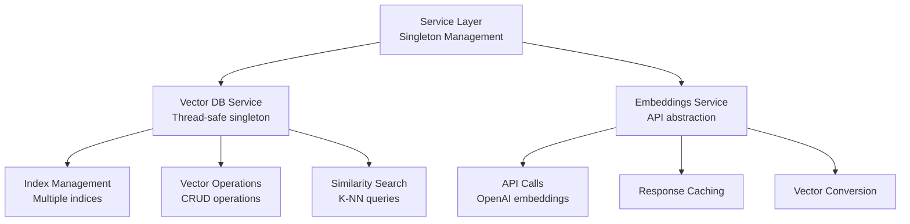
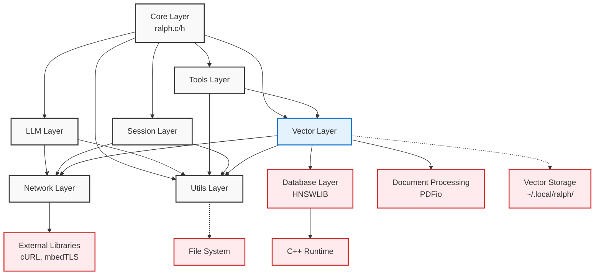
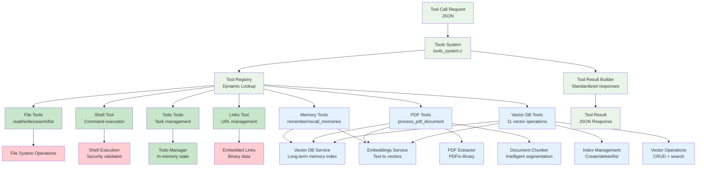
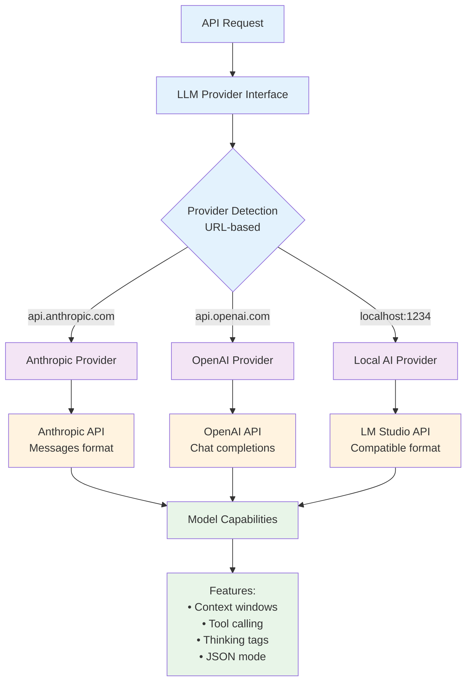

# Ralph Architecture

Ralph is a portable C-based AI assistant that provides a consistent interface across multiple LLM providers with an extensible tools system, persistent memory capabilities, and semantic document processing.

## System Architecture

```mermaid
graph TB
    %% User Interface Layer
    CLI[Command Line Interface<br/>main.c] --> Core[Ralph Core<br/>ralph.c/h]
    
    %% Core Application Layer
    Core --> Session[Session Manager<br/>session_manager.c/h]
    Core --> Config[Configuration<br/>RalphConfig]
    
    %% LLM Integration Layer
    Core --> LLMProvider[LLM Provider Abstraction<br/>llm_provider.c/h]
    LLMProvider --> ProviderRegistry[Provider Registry]
    
    ProviderRegistry --> Anthropic[Anthropic Provider<br/>anthropic_provider.c]
    ProviderRegistry --> OpenAI[OpenAI Provider<br/>openai_provider.c]
    ProviderRegistry --> LocalAI[Local AI Provider<br/>local_ai_provider.c]
    
    %% Model Capabilities
    LLMProvider --> ModelCaps[Model Capabilities<br/>model_capabilities.c/h]
    ModelCaps --> ClaudeModel[Claude Model<br/>claude_model.c]
    ModelCaps --> GPTModel[GPT Model<br/>gpt_model.c]
    ModelCaps --> QwenModel[Qwen Model<br/>qwen_model.c]
    ModelCaps --> DeepSeekModel[DeepSeek Model<br/>deepseek_model.c]
    ModelCaps --> DefaultModel[Default Model<br/>default_model.c]
    
    %% Tools System
    Core --> ToolsSystem[Tools System<br/>tools_system.c/h]
    ToolsSystem --> ToolRegistry[Tool Registry]
    
    ToolRegistry --> FileTools[File Tools<br/>file_tools.c/h]
    ToolRegistry --> ShellTool[Shell Tool<br/>shell_tool.c/h]
    ToolRegistry --> TodoTool[Todo Tool<br/>todo_tool.c/h]
    ToolRegistry --> LinksTool[Links Tool<br/>links_tool.c/h]
    ToolRegistry --> MemoryTool[Memory Tool<br/>memory_tool.c/h]
    ToolRegistry --> PDFTool[PDF Tool<br/>pdf_tool.c/h]
    ToolRegistry --> VectorDBTool[Vector DB Tool<br/>vector_db_tool.c/h]
    
    TodoTool --> TodoManager[Todo Manager<br/>todo_manager.c/h]
    TodoTool --> TodoDisplay[Todo Display<br/>todo_display.c/h]
    
    %% Vector Database System
    VectorDBTool --> VectorDBService[Vector DB Service<br/>vector_db_service.c/h]
    MemoryTool --> VectorDBService
    PDFTool --> VectorDBService
    
    VectorDBService --> VectorDB[Vector Database<br/>vector_db.c/h]
    VectorDB --> HNSWLib[HNSWLIB Library<br/>C++ Wrapper]
    
    %% Embeddings System
    VectorDBTool --> EmbeddingsService[Embeddings Service<br/>embeddings_service.c/h]
    MemoryTool --> EmbeddingsService
    PDFTool --> EmbeddingsService
    
    EmbeddingsService --> Embeddings[Embeddings<br/>embeddings.c/h]
    Embeddings --> HTTPClient
    
    %% Document Processing
    PDFTool --> PDFExtractor[PDF Extractor<br/>pdf_extractor.c/h]
    PDFTool --> DocumentChunker[Document Chunker<br/>document_chunker.c/h]
    
    PDFExtractor --> PDFio[PDFio Library]
    
    %% Utilities
    VectorDBTool --> ToolResultBuilder[Tool Result Builder<br/>tool_result_builder.c/h]
    MemoryTool --> ToolResultBuilder
    PDFTool --> ToolResultBuilder
    
    ToolsSystem --> CommonUtils[Common Utils<br/>common_utils.c/h]
    
    %% Session Management Layer
    Session --> ConversationTracker[Conversation Tracker<br/>conversation_tracker.c/h]
    Session --> TokenManager[Token Manager<br/>token_manager.c/h]
    Session --> ConversationCompactor[Conversation Compactor<br/>conversation_compactor.c/h]
    
    %% Network Layer
    Anthropic --> HTTPClient[HTTP Client<br/>http_client.c/h]
    OpenAI --> HTTPClient
    LocalAI --> HTTPClient
    
    HTTPClient --> APICommon[API Common<br/>api_common.c/h]
    
    %% Utilities Layer
    Core --> OutputFormatter[Output Formatter<br/>output_formatter.c/h]
    Core --> PromptLoader[Prompt Loader<br/>prompt_loader.c/h]
    Core --> EnvLoader[Env Loader<br/>env_loader.c/h]
    
    ToolsSystem --> JSONUtils[JSON Utils<br/>json_utils.c/h]
    APICommon --> JSONUtils
    ConversationTracker --> JSONUtils
    
    Core --> DebugOutput[Debug Output<br/>debug_output.c/h]
    
    %% External Dependencies
    HTTPClient --> cURL[cURL Library]
    HTTPClient --> mbedTLS[mbedTLS Library]
    VectorDB --> pthread[pthreads]
    VectorDBService --> pthread
    HNSWLib --> CPP[C++ Runtime]
    
    %% File System
    ConversationTracker --> FileSystem[File System<br/>CONVERSATION.md]
    EnvLoader --> EnvFile[.env File]
    PromptLoader --> PromptFile[system.prompt]
    VectorDBService --> VectorStorage[Vector Storage<br/>~/.local/ralph/]
    
    %% Styling
    classDef coreLayer fill:#e1f5fe
    classDef llmLayer fill:#f3e5f5
    classDef toolsLayer fill:#e8f5e8
    classDef sessionLayer fill:#fff3e0
    classDef networkLayer fill:#fce4ec
    classDef utilsLayer fill:#f1f8e9
    classDef vectorLayer fill:#e3f2fd
    classDef externalLayer fill:#efebe9
    
    class CLI,Core,Session,Config coreLayer
    class LLMProvider,ProviderRegistry,Anthropic,OpenAI,LocalAI,ModelCaps,ClaudeModel,GPTModel,QwenModel,DeepSeekModel,DefaultModel llmLayer
    class ToolsSystem,ToolRegistry,FileTools,ShellTool,TodoTool,LinksTool,MemoryTool,PDFTool,VectorDBTool,TodoManager,TodoDisplay toolsLayer
    class ConversationTracker,TokenManager,ConversationCompactor sessionLayer
    class HTTPClient,APICommon networkLayer
    class OutputFormatter,PromptLoader,EnvLoader,JSONUtils,DebugOutput,ToolResultBuilder,CommonUtils utilsLayer
    class VectorDBService,VectorDB,EmbeddingsService,Embeddings,PDFExtractor,DocumentChunker vectorLayer
    class cURL,mbedTLS,FileSystem,EnvFile,PromptFile,VectorStorage,HNSWLib,PDFio,pthread,CPP externalLayer
```

## Component Data Flow

## Key Architectural Patterns

### 1. Plugin Architecture
- **LLM Providers**: Each provider implements the `LLMProvider` interface
- **Tools**: Each tool registers with the `ToolRegistry` for dynamic execution
- **Models**: Model-specific capabilities are registered in the `ModelRegistry`
- **Vector Storage**: Pluggable vector database backends with HNSWLIB integration

### 2. Registry Pattern

### 3. Session-Based Design

### 4. Service Layer Pattern

## Module Dependencies

## Tool System Architecture

## Provider Abstraction

## Key Features

- **Multi-Provider Support**: Seamlessly works with Anthropic, OpenAI, and local LLM servers
- **Extensible Tools**: Plugin architecture for adding new tools and capabilities
- **Conversation Persistence**: Automatic conversation tracking and history management
- **Token Management**: Intelligent context window optimization and conversation compaction
- **Vector Database Integration**: Persistent semantic memory with HNSWLIB backend
- **Document Processing**: Automatic PDF extraction, chunking, and indexing
- **Embeddings Service**: Centralized embedding generation with OpenAI's text-embedding-3-small
- **Long-term Memory System**: Semantic storage and retrieval of important information
- **Thread-Safe Services**: Concurrent access to vector databases with mutex protection
- **Portable**: Built with Cosmopolitan for universal binary compatibility
- **Memory Safe**: Defensive programming with comprehensive error handling
- **Testable**: Extensive test suite covering all major components including vector operations

## New Tool Categories

### Memory Tools
- **`remember`**: Store information in long-term semantic memory
- **`recall_memories`**: Search and retrieve relevant memories using semantic similarity

### PDF Processing Tools  
- **`process_pdf_document`**: Extract text from PDFs and automatically index in vector database

### Vector Database Tools (11 tools)
- **Index Management**: `vector_db_create_index`, `vector_db_delete_index`, `vector_db_list_indices`
- **Vector Operations**: `vector_db_add_vector`, `vector_db_update_vector`, `vector_db_delete_vector`, `vector_db_get_vector`
- **Search Operations**: `vector_db_search`
- **Text Operations**: `vector_db_add_text`, `vector_db_add_chunked_text`, `vector_db_add_pdf_document`

## Storage and Persistence

- **Default Storage Location**: `~/.local/ralph/` for all vector database indices
- **Index Configuration**: Separate configurations for memory storage vs document storage
- **Thread Safety**: Mutex-protected singleton services for concurrent access
- **Automatic Initialization**: Services initialize automatically on first use
- **Rich Metadata**: Timestamps, content types, and classification for all stored vectors