# Ralph Architecture

Ralph is a portable C-based AI assistant that provides a consistent interface across multiple LLM providers with an extensible tools system, persistent memory capabilities, and semantic document processing.

## System Architecture

```mermaid
graph TB
    %% User Interface Layer
    CLI[Command Line Interface<br/>main.c] --> Core[Ralph Core<br/>ralph.c/h]
    CLI --> MemoryCommands[Memory Commands<br/>memory_commands.c/h]

    %% Core Application Layer
    Core --> Session[Session Manager<br/>session_manager.c/h]
    Core --> ConfigSystem[Config System<br/>config.c/h]
    Core --> MCPClient[MCP Client<br/>mcp_client.c/h]
    Core --> ContextEnhancement[Context Enhancement<br/>context_enhancement.c/h]
    Core --> RecapModule[Recap Generator<br/>recap.c/h]
    Core --> StreamingHandler[Streaming Handler<br/>streaming_handler.c/h]
    Core --> ToolExecutor[Tool Executor<br/>tool_executor.c/h]

    %% Approval Gate System
    ToolExecutor --> ApprovalGate[Approval Gate<br/>approval_gate.c/h]
    ApprovalGate --> RateLimiter[Rate Limiter<br/>rate_limiter.c/h]
    ApprovalGate --> Allowlist[Allowlist<br/>allowlist.c/h]
    ApprovalGate --> GatePrompter[Gate Prompter<br/>gate_prompter.c/h]
    ApprovalGate --> ProtectedFiles[Protected Files<br/>protected_files.c/h]
    ApprovalGate --> ShellParser[Shell Parser<br/>shell_parser.c/h]
    ApprovalGate --> AtomicFile[Atomic File<br/>atomic_file.c/h]
    ApprovalGate --> SubagentApproval[Subagent Approval<br/>subagent_approval.c/h]
    GatePrompter --> PatternGen[Pattern Generator<br/>pattern_generator.c/h]
    ProtectedFiles --> PathNormalize[Path Normalize<br/>path_normalize.c/h]

    %% MCP Integration
    MCPClient --> MCPServers[MCP Server Connections<br/>STDIO/HTTP/SSE]
    MCPClient --> ToolRegistry

    %% LLM Integration Layer
    Core --> LLMProvider[LLM Provider Abstraction<br/>llm_provider.c/h]
    LLMProvider --> ProviderRegistry[Provider Registry]

    ProviderRegistry --> Anthropic[Anthropic Provider<br/>anthropic_provider.c]
    ProviderRegistry --> OpenAI[OpenAI Provider<br/>openai_provider.c]
    ProviderRegistry --> LocalAI[Local AI Provider<br/>local_ai_provider.c]

    %% Model Capabilities
    LLMProvider --> ModelCaps[Model Capabilities<br/>model_capabilities.c/h]
    ModelCaps --> ClaudeModel[Claude Model<br/>claude_model.c]
    ModelCaps --> GPTModel[GPT Model<br/>gpt_model.c]
    ModelCaps --> QwenModel[Qwen Model<br/>qwen_model.c]
    ModelCaps --> DeepSeekModel[DeepSeek Model<br/>deepseek_model.c]
    ModelCaps --> DefaultModel[Default Model<br/>default_model.c]

    %% Tools System
    Core --> ToolsSystem[Tools System<br/>tools_system.c/h]
    ToolsSystem --> ToolRegistry[Tool Registry]

    ToolRegistry --> PythonTool[Python Tool<br/>python_tool.c/h]
    ToolRegistry --> PythonFileTools[Python File Tools<br/>python_tool_files.c/h]
    ToolRegistry --> TodoTool[Todo Tool<br/>todo_tool.c/h]
    ToolRegistry --> MemoryTool[Memory Tool<br/>memory_tool.c/h]
    ToolRegistry --> PDFTool[PDF Tool<br/>pdf_tool.c/h]
    ToolRegistry --> VectorDBTool[Vector DB Tool<br/>vector_db_tool.c/h]
    ToolRegistry --> SubagentTool[Subagent Tool<br/>subagent_tool.c/h]

    PythonFileTools --> PythonDefaults[Python Defaults<br/>python_defaults/]
    TodoTool --> TodoManager[Todo Manager<br/>todo_manager.c/h]
    TodoTool --> TodoDisplay[Todo Display<br/>todo_display.c/h]

    %% Vector Database System
    VectorDBTool --> VectorDBService[Vector DB Service<br/>vector_db_service.c/h]
    MemoryTool --> VectorDBService
    PDFTool --> VectorDBService
    MemoryCommands --> VectorDBService

    VectorDBService --> DocumentStore[Document Store<br/>document_store.c/h]
    VectorDBService --> MetadataStore[Metadata Store<br/>metadata_store.c/h]
    VectorDBService --> VectorDB[Vector Database<br/>vector_db.c/h]
    VectorDB --> HNSWLib[HNSWLIB Library<br/>hnswlib_wrapper.h]

    %% Embeddings System
    VectorDBTool --> EmbeddingsService[Embeddings Service<br/>embeddings_service.c/h]
    MemoryTool --> EmbeddingsService
    PDFTool --> EmbeddingsService
    MemoryCommands --> EmbeddingsService

    EmbeddingsService --> EmbeddingProvider[Embedding Provider<br/>embedding_provider.c/h]
    EmbeddingProvider --> EmbedProviderRegistry[Embedding Provider Registry]
    EmbedProviderRegistry --> OpenAIEmbed[OpenAI Embeddings<br/>openai_embedding_provider.c]
    EmbedProviderRegistry --> LocalEmbed[Local Embeddings<br/>local_embedding_provider.c]
    EmbeddingProvider --> HTTPClient

    %% Document Processing
    PDFTool --> PDFExtractor[PDF Extractor<br/>pdf_extractor.c/h]
    PDFTool --> DocumentChunker[Document Chunker<br/>document_chunker.c/h]
    PDFTool --> PDFProcessor[PDF Processor<br/>pdf_processor.c/h]

    PDFExtractor --> PDFio[PDFio Library]

    %% Context Retrieval
    Core --> ContextRetriever[Context Retriever<br/>context_retriever.c/h]
    ContextRetriever --> VectorDBService
    ContextRetriever --> EmbeddingsService

    %% Utilities
    VectorDBTool --> ToolResultBuilder[Tool Result Builder<br/>tool_result_builder.c/h]
    MemoryTool --> ToolResultBuilder
    PDFTool --> ToolResultBuilder

    ToolsSystem --> CommonUtils[Common Utils<br/>common_utils.c/h]

    %% Session Management Layer
    Session --> ConversationTracker[Conversation Tracker<br/>conversation_tracker.c/h]
    Session --> TokenManager[Token Manager<br/>token_manager.c/h]
    Session --> ConversationCompactor[Conversation Compactor<br/>conversation_compactor.c/h]
    ConversationTracker --> DocumentStore

    %% Network Layer
    Anthropic --> HTTPClient[HTTP Client<br/>http_client.c/h]
    OpenAI --> HTTPClient
    LocalAI --> HTTPClient
    MCPClient --> HTTPClient

    HTTPClient --> APICommon[API Common<br/>api_common.c/h]

    %% Utilities Layer
    Core --> OutputFormatter[Output Formatter<br/>output_formatter.c/h]
    Core --> PromptLoader[Prompt Loader<br/>prompt_loader.c/h]
    Core --> EnvLoader[Env Loader<br/>env_loader.c/h]

    ToolsSystem --> JSONEscape[JSON Escape<br/>json_escape.c/h]
    APICommon --> JSONEscape
    ConversationTracker --> cJSON[cJSON Library]

    Core --> DebugOutput[Debug Output<br/>debug_output.c/h]

    %% External Dependencies
    HTTPClient --> cURL[cURL Library]
    HTTPClient --> mbedTLS[mbedTLS Library]
    VectorDB --> pthread[pthreads]
    VectorDBService --> pthread
    HNSWLib --> CPP[C++ Runtime]

    %% File System
    ConversationTracker --> FileSystem[File System<br/>CONVERSATION.md]
    EnvLoader --> EnvFile[.env File]
    PromptLoader --> PromptFile[PROMPT.md]
    ConfigSystem --> ConfigFile[Config File<br/>ralph.config.json]
    VectorDBService --> VectorStorage[Vector Storage<br/>~/.local/ralph/]
    DocumentStore --> DocStorage[Document JSON<br/>~/.local/ralph/documents/]
    MetadataStore --> MetaStorage[Metadata JSON<br/>~/.local/ralph/metadata/]

    %% Styling
    classDef coreLayer fill:#e1f5fe
    classDef llmLayer fill:#f3e5f5
    classDef toolsLayer fill:#e8f5e8
    classDef sessionLayer fill:#fff3e0
    classDef networkLayer fill:#fce4ec
    classDef utilsLayer fill:#f1f8e9
    classDef vectorLayer fill:#e3f2fd
    classDef externalLayer fill:#efebe9
    classDef mcpLayer fill:#fff9c4
    classDef policyLayer fill:#ffccbc

    class CLI,Core,Session,ConfigSystem,MemoryCommands,ContextEnhancement,RecapModule,StreamingHandler,ToolExecutor coreLayer
    class ApprovalGate,RateLimiter,Allowlist,GatePrompter,ProtectedFiles,ShellParser,AtomicFile,SubagentApproval,PatternGen,PathNormalize policyLayer
    class LLMProvider,ProviderRegistry,Anthropic,OpenAI,LocalAI,ModelCaps,ClaudeModel,GPTModel,QwenModel,DeepSeekModel,DefaultModel llmLayer
    class ToolsSystem,ToolRegistry,PythonTool,PythonFileTools,PythonDefaults,TodoTool,MemoryTool,PDFTool,VectorDBTool,SubagentTool,TodoManager,TodoDisplay toolsLayer
    class ConversationTracker,TokenManager,ConversationCompactor sessionLayer
    class HTTPClient,APICommon networkLayer
    class OutputFormatter,PromptLoader,EnvLoader,JSONEscape,DebugOutput,ToolResultBuilder,CommonUtils,ContextRetriever utilsLayer
    class VectorDBService,VectorDB,EmbeddingsService,EmbeddingProvider,EmbedProviderRegistry,OpenAIEmbed,LocalEmbed,PDFExtractor,DocumentChunker,PDFProcessor,DocumentStore,MetadataStore vectorLayer
    class cURL,mbedTLS,FileSystem,EnvFile,PromptFile,ConfigFile,VectorStorage,DocStorage,MetaStorage,HNSWLib,PDFio,pthread,CPP,cJSON externalLayer
    class MCPClient,MCPServers mcpLayer
```

## Component Data Flow

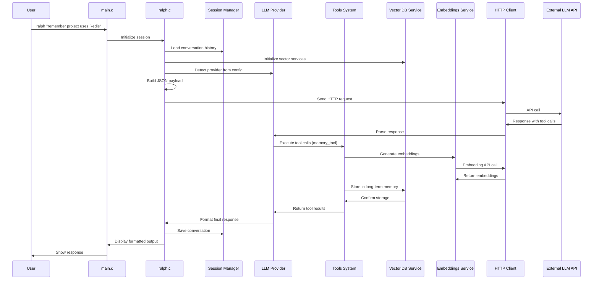

## Key Architectural Patterns

### 1. Plugin Architecture
- **LLM Providers**: Each provider implements the `LLMProvider` interface
- **Tools**: Each tool registers with the `ToolRegistry` for dynamic execution
- **Models**: Model-specific capabilities are registered in the `ModelRegistry`
- **Vector Storage**: Pluggable vector database backends with HNSWLIB integration

### 2. Registry Pattern
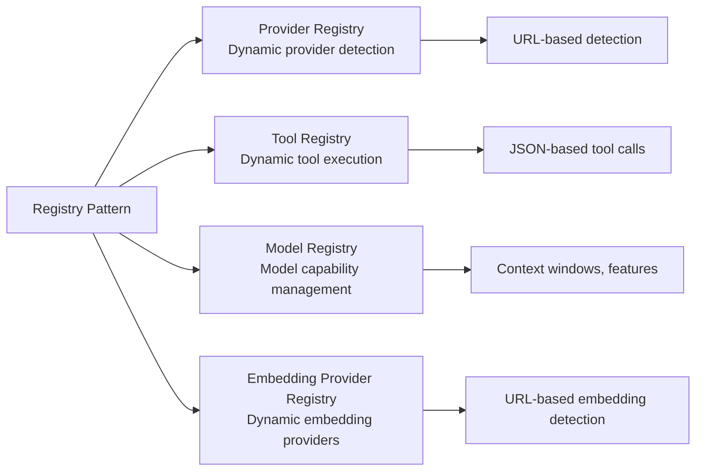

### 3. Session-Based Design
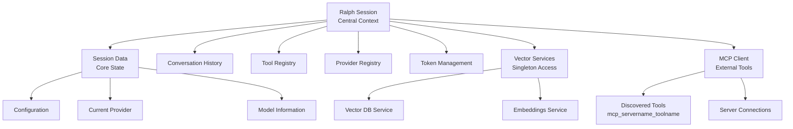

### 4. Service Layer Pattern
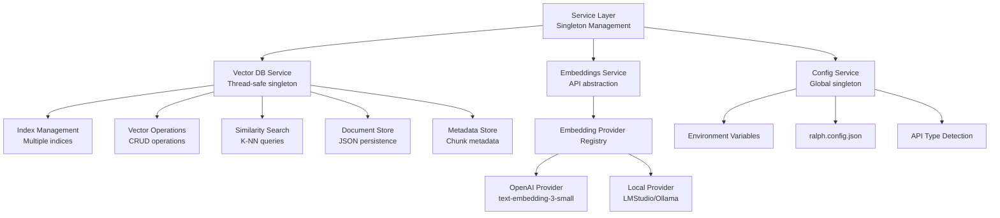

## Module Dependencies

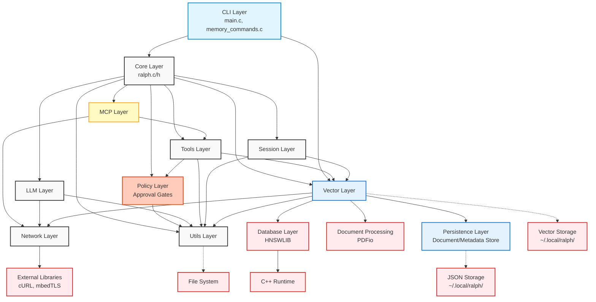

## Tool System Architecture

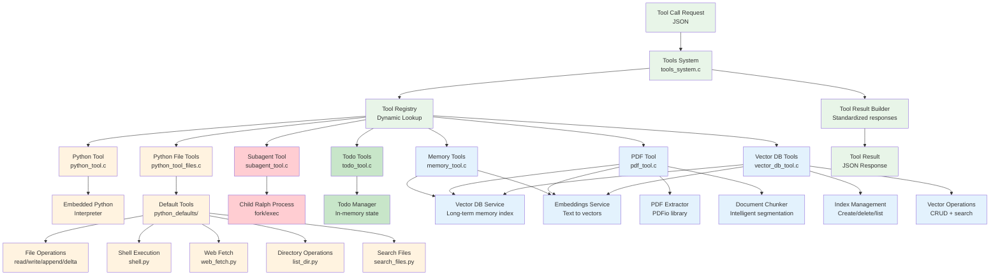

## Provider Abstraction

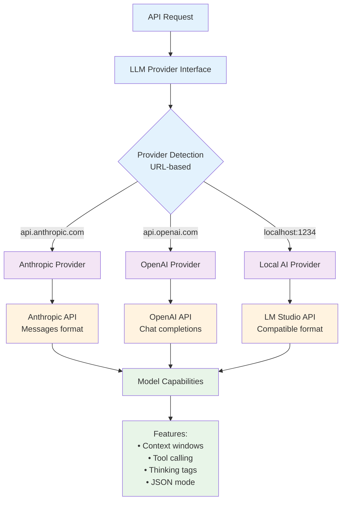

## MCP Client Architecture

The Model Context Protocol (MCP) client enables Ralph to connect to external tool servers for extended capabilities.


### MCP Features
- **Multi-Transport Support**: STDIO (local processes), HTTP, and SSE server connections
- **Dynamic Tool Discovery**: Tools fetched via JSON-RPC `tools/list` at connection time
- **Namespaced Tools**: MCP tools registered as `mcp_{servername}_{toolname}` to avoid conflicts
- **Environment Variable Expansion**: Supports `${VAR}` and `${VAR:-default}` in configuration
- **Graceful Degradation**: MCP is optional; Ralph functions without MCP servers configured

### MCP Configuration
MCP servers are configured in `ralph.config.json`:
```json
{
  "mcpServers": {
    "example-server": {
      "command": "/path/to/server",
      "args": ["--flag"],
      "env": { "KEY": "value" }
    }
  }
}
```

## Streaming Response Architecture

Ralph supports Server-Sent Events (SSE) streaming for real-time response display.

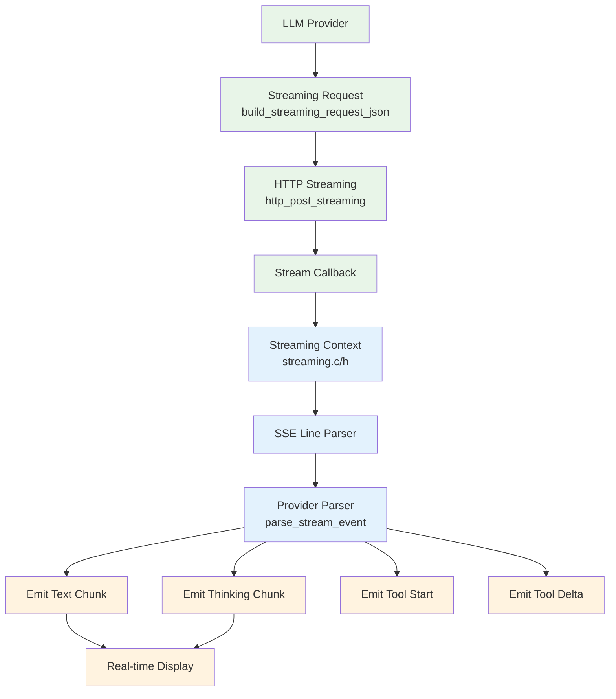

### Streaming Features
- Real-time text streaming to console
- Extended thinking content accumulation
- Tool call argument accumulation from deltas
- Provider-specific SSE parsing (Anthropic events vs OpenAI data lines)
- Configurable via `--no-stream` flag to disable

## Subagent System

Ralph can spawn child processes to execute tasks in parallel.

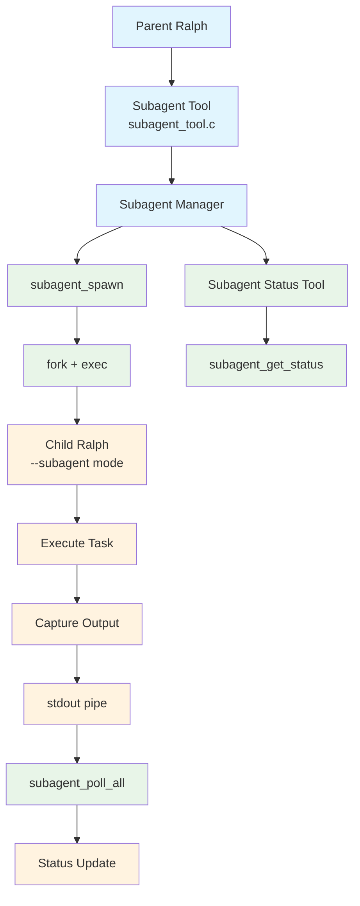

### Subagent Configuration
- `max_subagents`: Maximum concurrent subagents (default: 5)
- `subagent_timeout`: Timeout in seconds (default: 300)

### Subagent Tool Commands
- `subagent`: Spawn a new subagent with a task
- `subagent_status`: Query subagent status with optional blocking wait

## Approval Gate System

Ralph implements a comprehensive approval gate system that controls tool execution based on security categories and user preferences.

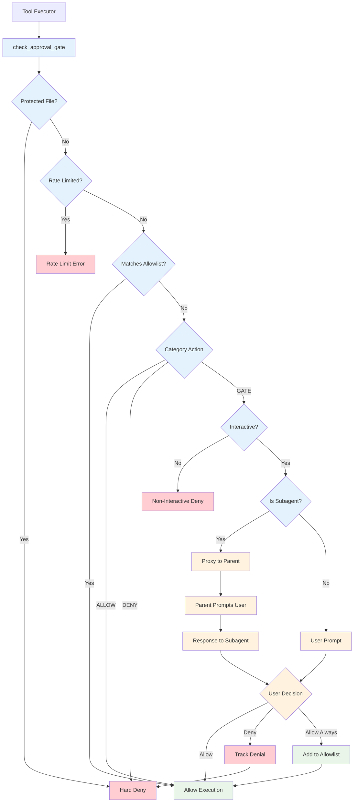

### Tool Categories

| Category | Default Action | Description |
|----------|---------------|-------------|
| `file_read` | ALLOW | File reading operations |
| `file_write` | GATE | File writing operations |
| `shell` | GATE | Shell command execution |
| `network` | GATE | Network requests |
| `memory` | ALLOW | Memory tool operations |
| `subagent` | GATE | Spawning subagents |
| `mcp` | GATE | MCP tool execution |
| `python` | ALLOW | Python code execution |

### Key Components

- **Approval Gate** (`approval_gate.c/h`): Core orchestration logic for gate checking
- **Rate Limiter** (`rate_limiter.c/h`): Exponential backoff after repeated denials
- **Allowlist** (`allowlist.c/h`): Regex and shell command pattern matching
- **Gate Prompter** (`gate_prompter.c/h`): Terminal UI for user approval
- **Pattern Generator** (`pattern_generator.c/h`): Auto-generate allowlist patterns
- **Protected Files** (`protected_files.c/h`): Hard-block access to sensitive files
- **Shell Parser** (`shell_parser.c/h`): Cross-platform shell command parsing (POSIX/CMD/PowerShell)
- **Atomic File** (`atomic_file.c/h`): TOCTOU-safe file operations
- **Subagent Approval** (`subagent_approval.c/h`): IPC-based approval proxying for child processes

### CLI Flags

- `--yolo`: Disable all approval gates for the session
- `--allow "tool:pattern"`: Add entry to session allowlist
- `--allow-category=<category>`: Set category action to ALLOW

### Configuration

Gates are configured in `ralph.config.json`:
```json
{
  "approval_gates": {
    "enabled": true,
    "categories": {
      "file_write": "gate",
      "shell": "gate",
      "network": "allow"
    },
    "allowlist": [
      {"tool": "shell", "pattern": ["git", "status"]}
    ]
  }
}
```

## CLI Commands

Interactive slash commands provide direct access to memory management without LLM involvement.

```mermaid
graph TB
    CLI[main.c<br/>Interactive Mode] --> CommandParser[Command Parser<br/>Slash commands]

    CommandParser --> MemoryCommands[Memory Commands<br/>memory_commands.c/h]

    MemoryCommands --> MemList[/memory list<br/>List chunks]
    MemoryCommands --> MemSearch[/memory search<br/>Search chunks]
    MemoryCommands --> MemShow[/memory show<br/>Show chunk details]
    MemoryCommands --> MemEdit[/memory edit<br/>Edit metadata]
    MemoryCommands --> MemIndices[/memory indices<br/>List indices]
    MemoryCommands --> MemStats[/memory stats<br/>Index statistics]

    MemList --> MetadataStore[Metadata Store]
    MemSearch --> MetadataStore
    MemShow --> MetadataStore
    MemEdit --> MetadataStore
    MemEdit --> VectorDB[Vector DB Service]
    MemEdit --> EmbeddingsService[Embeddings Service]
    MemIndices --> VectorDB
    MemStats --> VectorDB

    classDef cli fill:#e1f5fe
    classDef commands fill:#c8e6c9
    classDef services fill:#e3f2fd

    class CLI,CommandParser cli
    class MemoryCommands,MemList,MemSearch,MemShow,MemEdit,MemIndices,MemStats commands
    class MetadataStore,VectorDB,EmbeddingsService services
```

### Available Slash Commands
| Command | Arguments | Description |
|---------|-----------|-------------|
| `/memory help` | - | Display help message |
| `/memory list` | `[index_name]` | List chunks from index (default: long_term_memory) |
| `/memory search` | `<query>` | Search chunks by content/metadata |
| `/memory show` | `<chunk_id>` | Display full details of a chunk |
| `/memory edit` | `<chunk_id> <field> <value>` | Edit chunk metadata |
| `/memory indices` | - | List all available indices with stats |
| `/memory stats` | `[index_name]` | Show statistics for index |

## Embedding Provider Abstraction

The embedding system uses a parallel registry pattern to the LLM provider system.

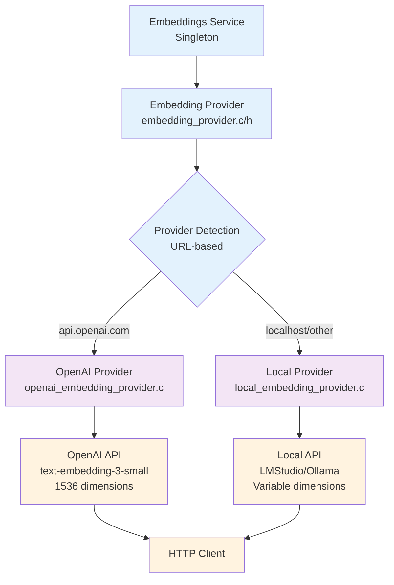

### Embedding Configuration
- **Separate API URL**: `embedding_api_url` can differ from `openai_api_url`
- **Model Selection**: Configurable via `embedding_model` setting
- **Known Dimensions**: text-embedding-3-small (1536), text-embedding-3-large (3072)
- **Local Models**: Supports Qwen3-Embedding, all-MiniLM, all-mpnet, and others

## Data Persistence Layer

Ralph uses a layered persistence architecture for semantic storage.

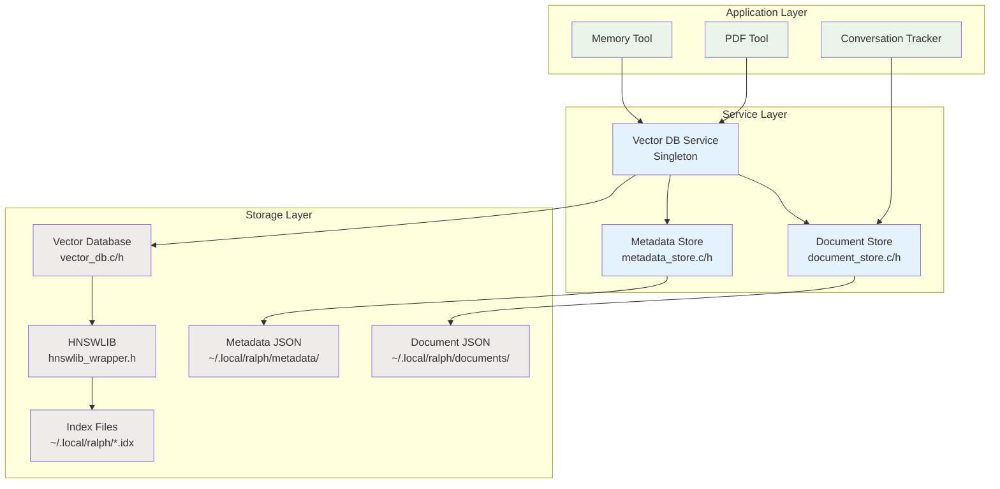

### Storage Locations
| Type | Path | Format |
|------|------|--------|
| Vector Indices | `~/.local/ralph/*.idx` | HNSWLIB binary |
| Index Metadata | `~/.local/ralph/*.meta` | JSON |
| Documents | `~/.local/ralph/documents/{index}/doc_{id}.json` | JSON |
| Chunk Metadata | `~/.local/ralph/metadata/{index}/chunk_{id}.json` | JSON |

### Index Configurations
| Index Type | Max Elements | M | ef_construction | Use Case |
|------------|--------------|---|-----------------|----------|
| Memory | 100,000 | 16 | 200 | Long-term semantic memory |
| Documents | 50,000 | 32 | 400 | PDF and document storage |

## Key Features

- **Multi-Provider Support**: Seamlessly works with Anthropic, OpenAI, and local LLM servers
- **Extensible Tools**: Plugin architecture for adding new tools and capabilities
- **Approval Gates**: Category-based tool access control with user prompts, allowlists, and rate limiting
- **MCP Integration**: Model Context Protocol support for external tool servers (STDIO/HTTP/SSE)
- **Interactive CLI Commands**: Slash commands for direct memory management (`/memory`)
- **Conversation Persistence**: Automatic conversation tracking with vector database integration
- **Token Management**: Intelligent context window optimization and conversation compaction
- **Vector Database Integration**: Persistent semantic memory with HNSWLIB backend
- **Document Processing**: Automatic PDF extraction, chunking, and indexing
- **Dual Embedding Providers**: Support for OpenAI and local embedding services (LMStudio, Ollama)
- **Layered Persistence**: Document Store + Metadata Store for rich semantic storage
- **Long-term Memory System**: Semantic storage and retrieval of important information
- **Thread-Safe Services**: Concurrent access to vector databases with mutex protection
- **Centralized Configuration**: JSON config file with environment variable support
- **Portable**: Built with Cosmopolitan for universal binary compatibility
- **Memory Safe**: Defensive programming with comprehensive error handling
- **Testable**: Extensive test suite covering all major components including vector operations

## Tool Categories

### Memory Tools (3 tools)
- **`remember`**: Store information in long-term semantic memory
- **`recall_memories`**: Search and retrieve relevant memories using semantic similarity
- **`forget_memory`**: Delete a memory by ID

### PDF Processing Tools
- **`pdf_extract_text`**: Extract text from PDFs with configurable page ranges and output format

### Python Tools (1 tool + file-based tools)
- **`python`**: Execute arbitrary Python code with embedded interpreter

### Python File Tools (9 tools loaded from `~/.local/ralph/tools/`)
- **`read_file`**: Read file contents
- **`write_file`**: Write content to file
- **`append_file`**: Append content to file
- **`file_info`**: Get file metadata
- **`list_dir`**: List directory contents
- **`search_files`**: Search for files matching patterns
- **`apply_delta`**: Apply unified diff to file
- **`shell`**: Execute shell commands
- **`web_fetch`**: Fetch web content

### Subagent Tools (2 tools)
- **`subagent`**: Spawn a child ralph process for parallel task execution
- **`subagent_status`**: Query the status of a running subagent

### Todo Tools (2 tools)
- **`TodoWrite`**: Create, update status/priority, delete, or bulk set todos
- **`TodoRead`**: List and filter todos by status and priority

### Vector Database Tools (13 tools)
- **Index Management**: `vector_db_create_index`, `vector_db_delete_index`, `vector_db_list_indices`
- **Vector Operations**: `vector_db_add_vector`, `vector_db_update_vector`, `vector_db_delete_vector`, `vector_db_get_vector`
- **Search Operations**: `vector_db_search`, `vector_db_search_text`, `vector_db_search_by_time`
- **Text Operations**: `vector_db_add_text`, `vector_db_add_chunked_text`, `vector_db_add_pdf_document`

## Storage and Persistence

- **Default Storage Location**: `~/.local/ralph/` for all vector database indices
- **Index Configuration**: Separate configurations for memory storage vs document storage
- **Thread Safety**: Mutex-protected singleton services for concurrent access
- **Automatic Initialization**: Services initialize automatically on first use
- **Rich Metadata**: Timestamps, content types, and classification for all stored vectors

## Directory Structure

```
src/
├── cli/                    # CLI command handlers
│   └── memory_commands.c/h # Interactive /memory slash commands
├── core/                   # Core application
│   ├── main.c              # Entry point (CLI interface, --json, --subagent modes)
│   ├── ralph.c/h           # Core orchestration logic
│   ├── context_enhancement.c/h  # Prompt enhancement with memory/context
│   ├── recap.c/h           # Conversation recap generation
│   ├── streaming_handler.c/h   # Streaming orchestration layer
│   └── tool_executor.c/h   # Tool-calling state machine
├── db/                     # Database layer
│   ├── vector_db.c/h       # Low-level HNSWLIB wrapper
│   ├── vector_db_service.c/h # Thread-safe singleton service
│   ├── document_store.c/h  # High-level document storage
│   ├── metadata_store.c/h  # Chunk metadata storage
│   ├── task_store.c/h      # SQLite-based persistent task storage
│   └── hnswlib_wrapper.cpp/h # C++ bridge
├── llm/                    # LLM integration
│   ├── llm_provider.c/h    # Provider abstraction
│   ├── model_capabilities.c/h # Model-specific capabilities
│   ├── embeddings.c/h      # Low-level embeddings API
│   ├── embeddings_service.c/h # Embeddings singleton service
│   ├── embedding_provider.c/h # Embedding provider abstraction
│   ├── models/             # Model implementations
│   │   ├── claude_model.c
│   │   ├── gpt_model.c
│   │   ├── qwen_model.c
│   │   ├── deepseek_model.c
│   │   ├── default_model.c
│   │   └── response_processing.c/h  # Thinking tag processing
│   └── providers/          # Provider implementations
│       ├── anthropic_provider.c
│       ├── openai_provider.c
│       ├── local_ai_provider.c
│       ├── openai_embedding_provider.c
│       └── local_embedding_provider.c
├── mcp/                    # Model Context Protocol
│   └── mcp_client.c/h      # MCP client implementation
├── network/                # Network layer
│   ├── http_client.c/h     # HTTP client (cURL wrapper)
│   ├── api_common.c/h      # API payload building
│   ├── streaming.c/h       # SSE streaming infrastructure
│   └── api_error.c/h       # Enhanced error handling with retries
├── pdf/                    # PDF processing
│   └── pdf_extractor.c/h   # PDFio-based text extraction
├── policy/                 # Approval gate system
│   ├── approval_gate.c/h   # Core approval orchestration
│   ├── allowlist.c/h       # Pattern matching allowlist
│   ├── rate_limiter.c/h    # Denial rate limiting
│   ├── gate_prompter.c/h   # Terminal UI prompts
│   ├── pattern_generator.c/h # Auto-generate patterns
│   ├── tool_args.c/h       # Tool argument extraction
│   ├── protected_files.c/h # Protected file detection
│   ├── path_normalize.c/h  # Cross-platform path normalization
│   ├── shell_parser.c/h    # POSIX shell parsing
│   ├── shell_parser_cmd.c  # cmd.exe parsing
│   ├── shell_parser_ps.c   # PowerShell parsing
│   ├── atomic_file.c/h     # TOCTOU-safe file operations
│   ├── subagent_approval.c/h # Subagent approval proxy
│   ├── verified_file_context.c/h # Thread-local verified file context
│   └── verified_file_python.c/h  # Python extension for verified I/O
├── session/                # Session management
│   ├── session_manager.c/h # Session data structures
│   ├── conversation_tracker.c/h # Conversation persistence
│   ├── token_manager.c/h   # Token counting/allocation
│   └── conversation_compactor.c/h # Context trimming
├── tools/                  # Tool implementations
│   ├── tools_system.c/h    # Tool registry and execution
│   ├── tools_system_safe.c # Safe tool execution helpers
│   ├── tool_result_builder.c/h # Result formatting
│   ├── memory_tool.c/h     # Semantic memory (remember, recall_memories, forget_memory)
│   ├── pdf_tool.c/h        # PDF processing tool
│   ├── vector_db_tool.c/h  # Vector DB operations (13 tools)
│   ├── python_tool.c/h     # Embedded Python interpreter
│   ├── python_tool_files.c/h # Python file-based tools
│   ├── subagent_tool.c/h   # Subagent process spawning
│   ├── todo_manager.c/h    # Todo data structures
│   ├── todo_tool.c/h       # Todo tool call handler
│   ├── todo_display.c/h    # Todo visualization
│   └── python_defaults/    # Default Python tool files
│       ├── read_file.py
│       ├── write_file.py
│       ├── append_file.py
│       ├── file_info.py
│       ├── list_dir.py
│       ├── search_files.py
│       ├── apply_delta.py
│       ├── shell.py
│       └── web_fetch.py
├── utils/                  # Utilities
│   ├── config.c/h          # Configuration management
│   ├── env_loader.c/h      # .env file loading
│   ├── prompt_loader.c/h   # System prompt loading
│   ├── output_formatter.c/h # Response formatting
│   ├── debug_output.c/h    # Debug logging
│   ├── document_chunker.c/h # Text chunking
│   ├── pdf_processor.c/h   # PDF download/processing
│   ├── context_retriever.c/h # Vector context retrieval
│   ├── json_escape.c/h     # JSON escaping
│   ├── json_output.c/h     # JSON output mode
│   └── common_utils.c/h    # General utilities
└── embedded_links.h        # Embedded Links browser binary
```

