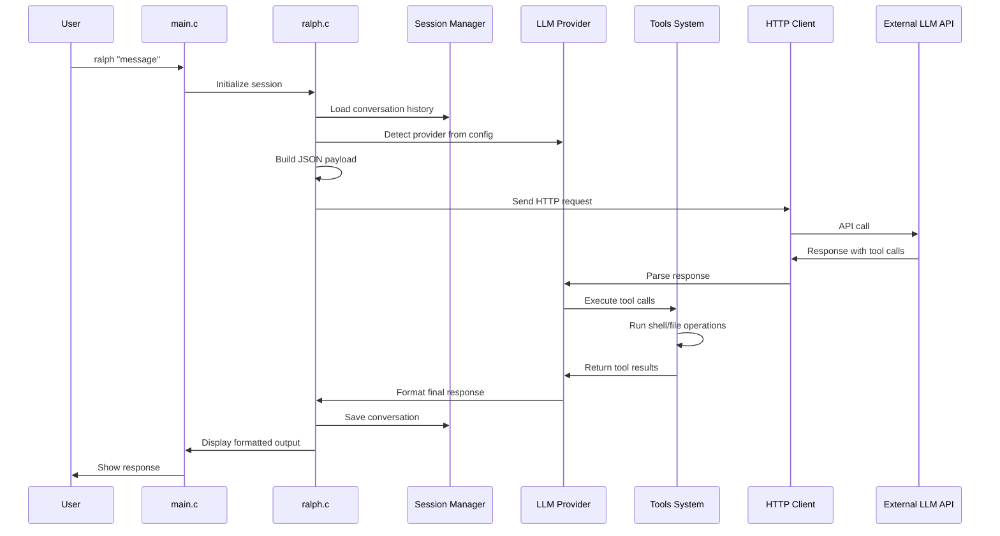
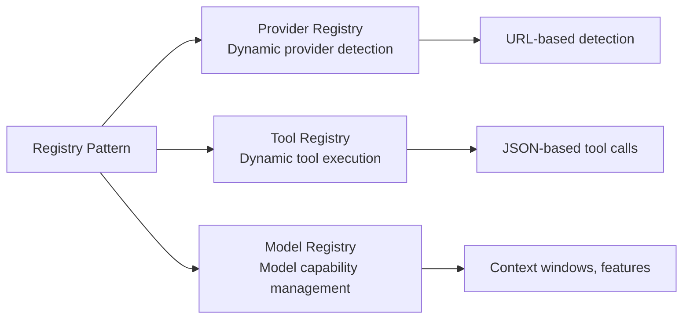
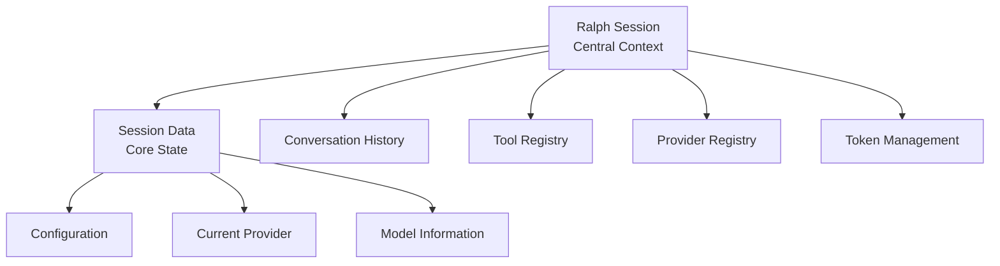
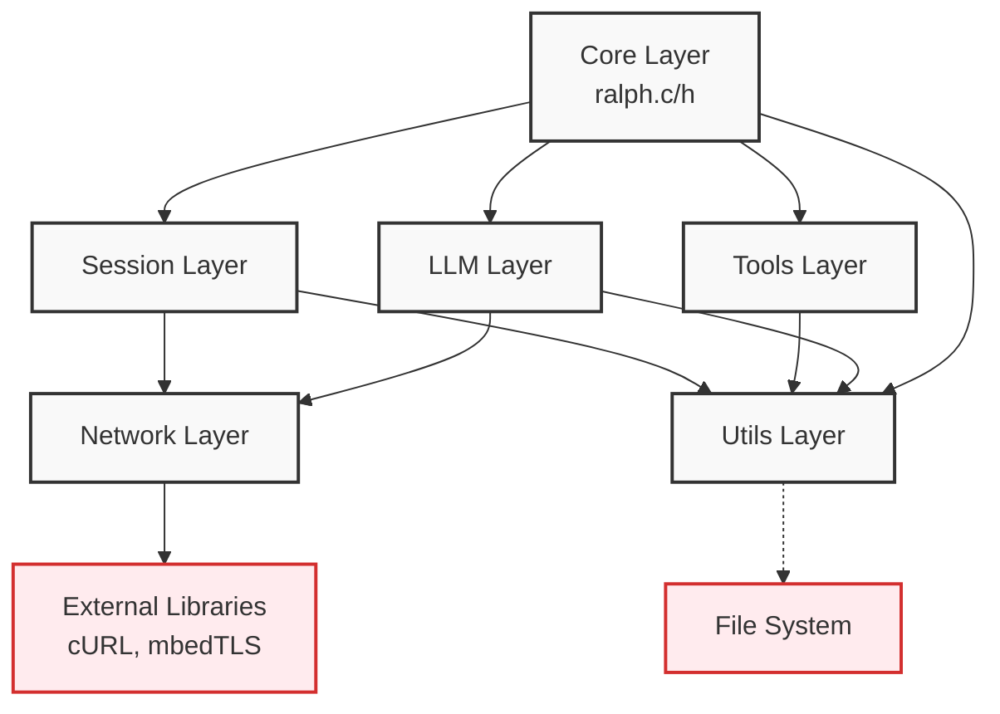
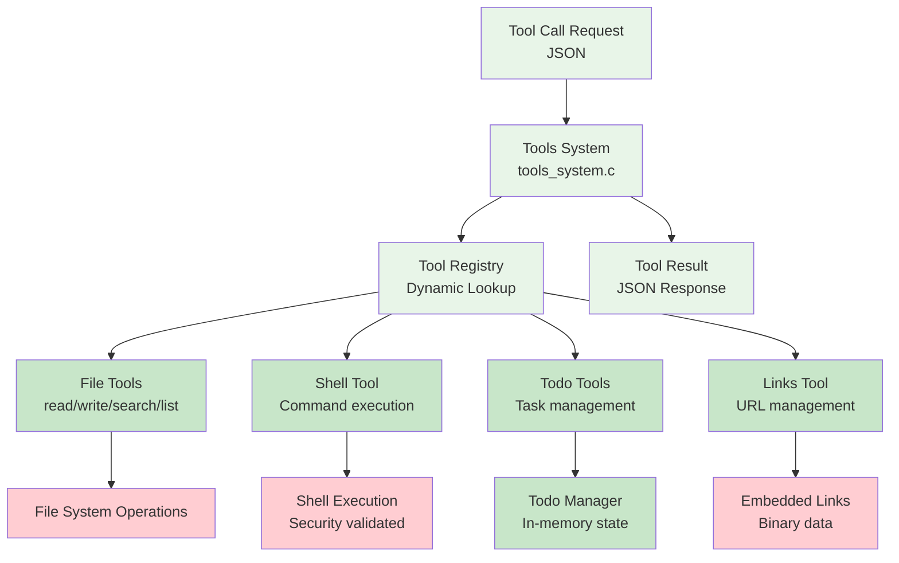
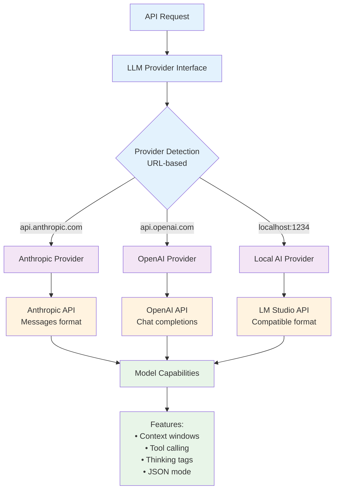

# Ralph Architecture

Ralph is a portable C-based AI assistant that provides a consistent interface across multiple LLM providers with an extensible tools system.

## System Architecture

```mermaid
graph TB
    %% User Interface Layer
    CLI[Command Line Interface<br/>main.c] --> Core[Ralph Core<br/>ralph.c/h]
    
    %% Core Application Layer
    Core --> Session[Session Manager<br/>session_manager.c/h]
    Core --> Config[Configuration<br/>RalphConfig]
    
    %% LLM Integration Layer
    Core --> LLMProvider[LLM Provider Abstraction<br/>llm_provider.c/h]
    LLMProvider --> ProviderRegistry[Provider Registry]
    
    ProviderRegistry --> Anthropic[Anthropic Provider<br/>anthropic_provider.c]
    ProviderRegistry --> OpenAI[OpenAI Provider<br/>openai_provider.c]
    ProviderRegistry --> LocalAI[Local AI Provider<br/>local_ai_provider.c]
    
    %% Model Capabilities
    LLMProvider --> ModelCaps[Model Capabilities<br/>model_capabilities.c/h]
    ModelCaps --> ClaudeModel[Claude Model<br/>claude_model.c]
    ModelCaps --> GPTModel[GPT Model<br/>gpt_model.c]
    ModelCaps --> QwenModel[Qwen Model<br/>qwen_model.c]
    ModelCaps --> DeepSeekModel[DeepSeek Model<br/>deepseek_model.c]
    ModelCaps --> DefaultModel[Default Model<br/>default_model.c]
    
    %% Tools System
    Core --> ToolsSystem[Tools System<br/>tools_system.c/h]
    ToolsSystem --> ToolRegistry[Tool Registry]
    
    ToolRegistry --> FileTools[File Tools<br/>file_tools.c/h]
    ToolRegistry --> ShellTool[Shell Tool<br/>shell_tool.c/h]
    ToolRegistry --> TodoTool[Todo Tool<br/>todo_tool.c/h]
    ToolRegistry --> LinksTool[Links Tool<br/>links_tool.c/h]
    
    TodoTool --> TodoManager[Todo Manager<br/>todo_manager.c/h]
    TodoTool --> TodoDisplay[Todo Display<br/>todo_display.c/h]
    
    %% Session Management Layer
    Session --> ConversationTracker[Conversation Tracker<br/>conversation_tracker.c/h]
    Session --> TokenManager[Token Manager<br/>token_manager.c/h]
    Session --> ConversationCompactor[Conversation Compactor<br/>conversation_compactor.c/h]
    
    %% Network Layer
    Anthropic --> HTTPClient[HTTP Client<br/>http_client.c/h]
    OpenAI --> HTTPClient
    LocalAI --> HTTPClient
    
    HTTPClient --> APICommon[API Common<br/>api_common.c/h]
    
    %% Utilities Layer
    Core --> OutputFormatter[Output Formatter<br/>output_formatter.c/h]
    Core --> PromptLoader[Prompt Loader<br/>prompt_loader.c/h]
    Core --> EnvLoader[Env Loader<br/>env_loader.c/h]
    
    ToolsSystem --> JSONUtils[JSON Utils<br/>json_utils.c/h]
    APICommon --> JSONUtils
    ConversationTracker --> JSONUtils
    
    Core --> DebugOutput[Debug Output<br/>debug_output.c/h]
    
    %% External Dependencies
    HTTPClient --> cURL[cURL Library]
    HTTPClient --> mbedTLS[mbedTLS Library]
    
    %% File System
    ConversationTracker --> FileSystem[File System<br/>CONVERSATION.md]
    EnvLoader --> EnvFile[.env File]
    PromptLoader --> PromptFile[system.prompt]
    
    %% Styling
    classDef coreLayer fill:#e1f5fe
    classDef llmLayer fill:#f3e5f5
    classDef toolsLayer fill:#e8f5e8
    classDef sessionLayer fill:#fff3e0
    classDef networkLayer fill:#fce4ec
    classDef utilsLayer fill:#f1f8e9
    classDef externalLayer fill:#efebe9
    
    class CLI,Core,Session,Config coreLayer
    class LLMProvider,ProviderRegistry,Anthropic,OpenAI,LocalAI,ModelCaps,ClaudeModel,GPTModel,QwenModel,DeepSeekModel,DefaultModel llmLayer
    class ToolsSystem,ToolRegistry,FileTools,ShellTool,TodoTool,LinksTool,TodoManager,TodoDisplay toolsLayer
    class ConversationTracker,TokenManager,ConversationCompactor sessionLayer
    class HTTPClient,APICommon networkLayer
    class OutputFormatter,PromptLoader,EnvLoader,JSONUtils,DebugOutput utilsLayer
    class cURL,mbedTLS,FileSystem,EnvFile,PromptFile externalLayer
```

## Component Data Flow

## Key Architectural Patterns

### 1. Plugin Architecture
- **LLM Providers**: Each provider implements the `LLMProvider` interface
- **Tools**: Each tool registers with the `ToolRegistry` for dynamic execution
- **Models**: Model-specific capabilities are registered in the `ModelRegistry`

### 2. Registry Pattern

### 3. Session-Based Design

## Module Dependencies

## Tool System Architecture

## Provider Abstraction

## Key Features

- **Multi-Provider Support**: Seamlessly works with Anthropic, OpenAI, and local LLM servers
- **Extensible Tools**: Plugin architecture for adding new tools and capabilities
- **Conversation Persistence**: Automatic conversation tracking and history management
- **Token Management**: Intelligent context window optimization and conversation compaction
- **Portable**: Built with Cosmopolitan for universal binary compatibility
- **Memory Safe**: Defensive programming with comprehensive error handling
- **Testable**: Extensive test suite covering all major components