# Ralph Architecture

Ralph is a portable C-based AI assistant that provides a consistent interface across multiple LLM providers with an extensible tools system, persistent memory capabilities, and semantic document processing.

## System Architecture

```mermaid
graph TB
    %% User Interface Layer
    CLI[Command Line Interface<br/>main.c] --> Core[Agent Core<br/>agent.c/h]
    CLI --> MemoryCommands[Memory Commands<br/>lib/ui/memory_commands.c/h]

    %% Core Application Layer
    Core --> Session[Session Manager<br/>session_manager.c/h]
    Core --> ConfigSystem[Config System<br/>config.c/h]
    Core --> MCPClient[MCP Client<br/>mcp_client.c/h]
    Core --> ContextEnhancement[Context Enhancement<br/>context_enhancement.c/h]
    Core --> RecapModule[Recap Generator<br/>recap.c/h]
    Core --> StreamingHandler[Streaming Handler<br/>streaming_handler.c/h]
    Core --> ToolExecutor[Tool Executor<br/>tool_executor.c/h]

    %% Approval Gate System
    ToolExecutor --> ApprovalGate[Approval Gate<br/>approval_gate.c/h]
    ApprovalGate --> RateLimiter[Rate Limiter<br/>rate_limiter.c/h]
    ApprovalGate --> Allowlist[Allowlist<br/>allowlist.c/h]
    ApprovalGate --> GatePrompter[Gate Prompter<br/>gate_prompter.c/h]
    ApprovalGate --> ProtectedFiles[Protected Files<br/>protected_files.c/h]
    ApprovalGate --> ShellParser[Shell Parser<br/>shell_parser.c/h]
    ApprovalGate --> AtomicFile[Atomic File<br/>atomic_file.c/h]
    ApprovalGate --> SubagentApproval[Subagent Approval<br/>subagent_approval.c/h]
    GatePrompter --> PatternGen[Pattern Generator<br/>pattern_generator.c/h]
    ProtectedFiles --> PathNormalize[Path Normalize<br/>path_normalize.c/h]

    %% MCP Integration
    MCPClient --> MCPServers[MCP Server Connections<br/>STDIO/HTTP/SSE]
    MCPClient --> ToolRegistry

    %% LLM Integration Layer
    Core --> LLMProvider[LLM Provider Abstraction<br/>llm_provider.c/h]
    LLMProvider --> ProviderRegistry[Provider Registry]

    ProviderRegistry --> Codex[Codex Provider<br/>codex_provider.c]
    ProviderRegistry --> Anthropic[Anthropic Provider<br/>anthropic_provider.c]
    ProviderRegistry --> OpenAI[OpenAI Provider<br/>openai_provider.c]
    ProviderRegistry --> LocalAI[Local AI Provider<br/>local_ai_provider.c]

    %% Model Capabilities
    LLMProvider --> ModelCaps[Model Capabilities<br/>model_capabilities.c/h]
    ModelCaps --> ModelRegistry[Model Registry<br/>model_registry.c]
    ModelCaps --> GPTModel[GPT Format<br/>gpt_model.c]
    ModelCaps --> ClaudeModel[Claude Format<br/>claude_model.c]

    %% Tools System
    Core --> ToolsSystem[Tools System<br/>tools_system.c/h]
    ToolsSystem --> ToolRegistry[Tool Registry]

    ToolRegistry --> PythonTool[Python Tool<br/>python_tool.c/h]
    ToolRegistry --> PythonFileTools[Python File Tools<br/>python_tool_files.c/h]
    ToolRegistry --> TodoTool[Todo Tool<br/>todo_tool.c/h]
    ToolRegistry --> MemoryTool[Memory Tool<br/>memory_tool.c/h]
    ToolRegistry --> PDFTool[PDF Tool<br/>pdf_tool.c/h]
    ToolRegistry --> VectorDBTool[Vector DB Tool<br/>vector_db_tool.c/h]
    ToolRegistry --> SubagentTool[Subagent Tool<br/>subagent_tool.c/h]
    ToolRegistry --> MessagingTool[Messaging Tool<br/>messaging_tool.c/h]
    ToolRegistry --> GOAPTools[GOAP Tools<br/>goap_tools.c/h]
    ToolRegistry --> OrchestratorTool[Orchestrator Tools<br/>orchestrator_tool.c/h]

    PythonFileTools --> PythonDefaults[Python Defaults<br/>python_defaults/]
    TodoTool --> TodoManager[Todo Manager<br/>todo_manager.c/h]
    TodoTool --> TodoDisplay[Todo Display<br/>todo_display.c/h]

    %% Vector Database System
    VectorDBTool --> VectorDBService[Vector DB Service<br/>vector_db_service.c/h]
    MemoryTool --> VectorDBService
    PDFTool --> VectorDBService
    MemoryCommands --> VectorDBService

    VectorDBService --> DocumentStore[Document Store<br/>document_store.c/h]
    VectorDBService --> MetadataStore[Metadata Store<br/>metadata_store.c/h]
    VectorDBService --> VectorDB[Vector Database<br/>vector_db.c/h]
    VectorDB --> HNSWLib[HNSWLIB Library<br/>hnswlib_wrapper.h]

    %% Embeddings System
    VectorDBTool --> EmbeddingsService[Embeddings Service<br/>embeddings_service.c/h]
    MemoryTool --> EmbeddingsService
    PDFTool --> EmbeddingsService
    MemoryCommands --> EmbeddingsService

    EmbeddingsService --> EmbeddingProvider[Embedding Provider<br/>embedding_provider.c/h]
    EmbeddingProvider --> EmbedProviderRegistry[Embedding Provider Registry]
    EmbedProviderRegistry --> OpenAIEmbed[OpenAI Embeddings<br/>openai_embedding_provider.c]
    EmbedProviderRegistry --> LocalEmbed[Local Embeddings<br/>local_embedding_provider.c]
    EmbeddingProvider --> HTTPClient

    %% Document Processing
    PDFTool --> PDFExtractor[PDF Extractor<br/>pdf_extractor.c/h]
    PDFTool --> DocumentChunker[Document Chunker<br/>document_chunker.c/h]
    PDFExtractor --> PDFio[PDFio Library]

    %% Context Retrieval
    Core --> ContextRetriever[Context Retriever<br/>context_retriever.c/h]
    ContextRetriever --> VectorDBService
    ContextRetriever --> EmbeddingsService

    %% Utilities
    VectorDBTool --> ToolResultBuilder[Tool Result Builder<br/>tool_result_builder.c/h]
    MemoryTool --> ToolResultBuilder
    PDFTool --> ToolResultBuilder

    ToolsSystem --> CommonUtils[Common Utils<br/>common_utils.c/h]

    %% Session Management Layer
    Session --> ConversationTracker[Conversation Tracker<br/>conversation_tracker.c/h]
    Session --> TokenManager[Token Manager<br/>token_manager.c/h]
    Session --> ConversationCompactor[Conversation Compactor<br/>conversation_compactor.c/h]
    ConversationTracker --> DocumentStore

    %% Auth Module
    CLI --> AuthLogin[OpenAI Login<br/>lib/auth/openai_login.c/h]
    Core --> AuthLogin
    AuthLogin --> OAuthProvider[OpenAI OAuth Provider<br/>openai_oauth_provider.c/h]
    AuthLogin --> CallbackServer[OAuth Callback Server<br/>oauth_callback_server.c/h]
    AuthLogin --> JWTDecode[JWT Decode<br/>jwt_decode.c/h]
    AuthLogin --> OAuth2Store[OAuth2 Store<br/>oauth2_store.c/h]
    OAuthProvider --> FormPost[HTTP Form POST<br/>http_form_post.c/h]

    %% Network Layer
    Codex --> HTTPClient[HTTP Client<br/>http_client.c/h]
    Anthropic --> HTTPClient
    OpenAI --> HTTPClient
    LocalAI --> HTTPClient
    MCPClient --> HTTPClient
    FormPost --> HTTPClient

    HTTPClient --> APICommon[API Common<br/>api_common.c/h]

    %% Utilities Layer
    Core --> OutputFormatter[Output Formatter<br/>output_formatter.c/h]
    Core --> PromptLoader[Prompt Loader<br/>prompt_loader.c/h]
    ToolsSystem --> JSONEscape[JSON Escape<br/>json_escape.c/h]
    APICommon --> JSONEscape
    ConversationTracker --> cJSON[cJSON Library]

    Core --> DebugOutput[Debug Output<br/>debug_output.c/h]

    %% External Dependencies
    HTTPClient --> cURL[cURL Library]
    HTTPClient --> mbedTLS[mbedTLS Library]
    VectorDB --> pthread[pthreads]
    VectorDBService --> pthread
    HNSWLib --> CPP[C++ Runtime]

    %% File System
    ConversationTracker --> FileSystem[File System<br/>CONVERSATION.md]
    PromptLoader --> PromptFile[PROMPT.md]
    ConfigSystem --> ConfigFile[Config File<br/>scaffold.config.json]
    VectorDBService --> VectorStorage[Vector Storage<br/>~/.local/scaffold/]
    DocumentStore --> DocStorage[Document JSON<br/>~/.local/scaffold/documents/]
    MetadataStore --> MetaStorage[Metadata JSON<br/>~/.local/scaffold/metadata/]

    %% Styling
    classDef coreLayer fill:#e1f5fe
    classDef llmLayer fill:#f3e5f5
    classDef toolsLayer fill:#e8f5e8
    classDef sessionLayer fill:#fff3e0
    classDef networkLayer fill:#fce4ec
    classDef utilsLayer fill:#f1f8e9
    classDef vectorLayer fill:#e3f2fd
    classDef externalLayer fill:#efebe9
    classDef mcpLayer fill:#fff9c4
    classDef policyLayer fill:#ffccbc
    classDef authLayer fill:#e8eaf6

    class CLI,Core,Session,ConfigSystem,MemoryCommands,ContextEnhancement,RecapModule,StreamingHandler,ToolExecutor coreLayer
    class ApprovalGate,RateLimiter,Allowlist,GatePrompter,ProtectedFiles,ShellParser,AtomicFile,SubagentApproval,PatternGen,PathNormalize policyLayer
    class LLMProvider,ProviderRegistry,Codex,Anthropic,OpenAI,LocalAI,ModelCaps,ClaudeModel,GPTModel,ModelRegistry llmLayer
    class AuthLogin,OAuthProvider,CallbackServer,JWTDecode,OAuth2Store,FormPost authLayer
    class ToolsSystem,ToolRegistry,PythonTool,PythonFileTools,PythonDefaults,TodoTool,MemoryTool,PDFTool,VectorDBTool,SubagentTool,MessagingTool,GOAPTools,OrchestratorTool,TodoManager,TodoDisplay toolsLayer
    class ConversationTracker,TokenManager,ConversationCompactor sessionLayer
    class HTTPClient,APICommon networkLayer
    class OutputFormatter,PromptLoader,JSONEscape,DebugOutput,ToolResultBuilder,CommonUtils,ContextRetriever utilsLayer
    class VectorDBService,VectorDB,EmbeddingsService,EmbeddingProvider,EmbedProviderRegistry,OpenAIEmbed,LocalEmbed,PDFExtractor,DocumentChunker,DocumentStore,MetadataStore vectorLayer
    class cURL,mbedTLS,FileSystem,PromptFile,ConfigFile,VectorStorage,DocStorage,MetaStorage,HNSWLib,PDFio,pthread,CPP,cJSON externalLayer
    class MCPClient,MCPServers mcpLayer
```

## Component Data Flow

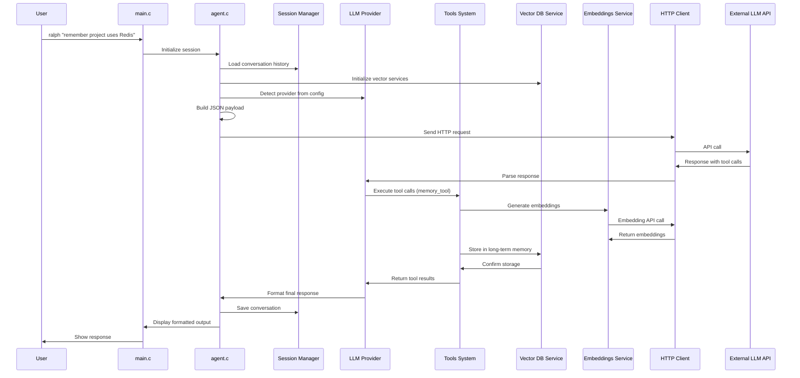

## Key Architectural Patterns

### 1. Plugin Architecture
- **LLM Providers**: Each provider implements the `LLMProvider` interface
- **Tools**: Each tool registers with the `ToolRegistry` for dynamic execution
- **Models**: Model-specific capabilities are registered in the `ModelRegistry`
- **Vector Storage**: Pluggable vector database backends with HNSWLIB integration

### 2. Registry Pattern
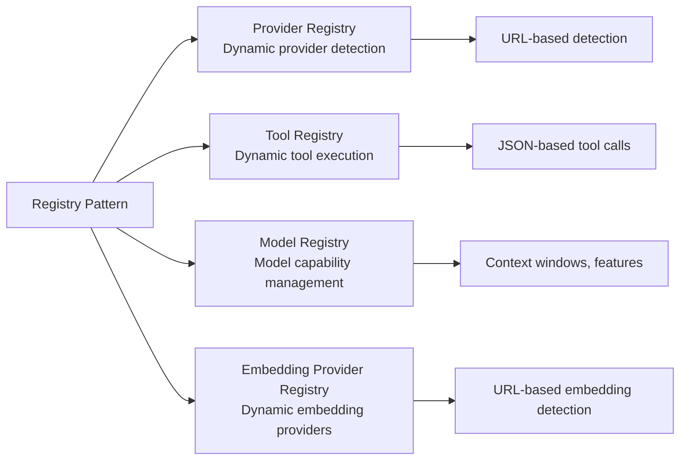

### 3. Session-Based Design
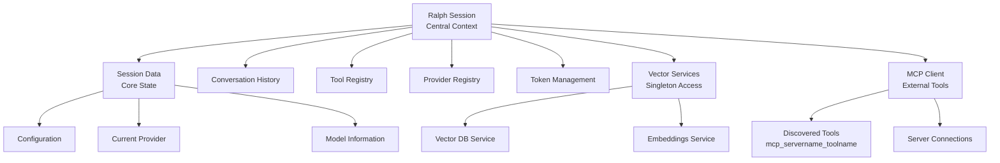

### 4. Service Layer Pattern
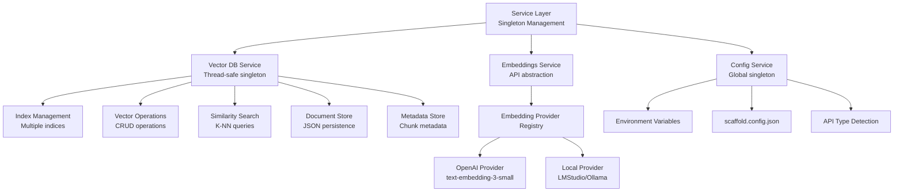

## Module Dependencies

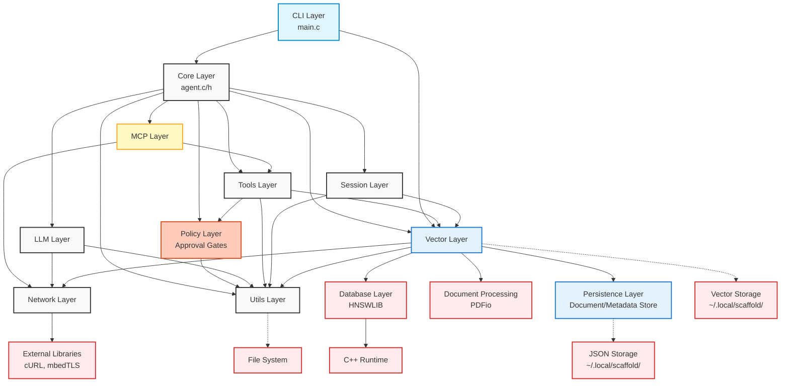

## Tool System Architecture

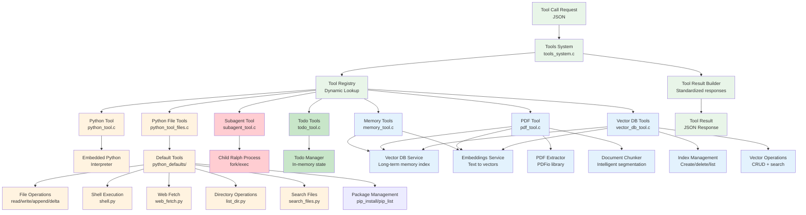

## Provider Abstraction

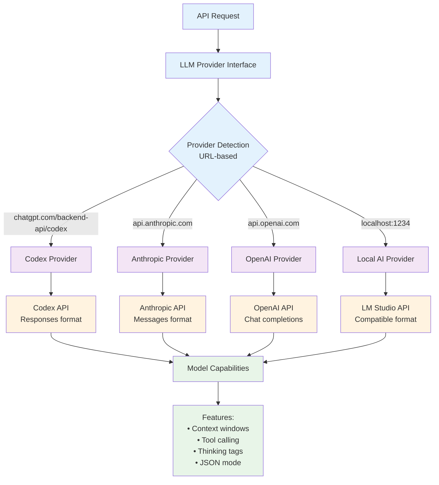

## MCP Client Architecture

The Model Context Protocol (MCP) client enables Ralph to connect to external tool servers for extended capabilities.

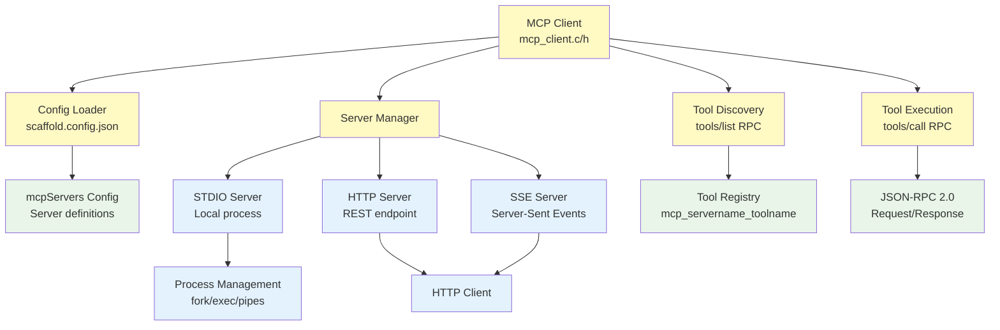

### MCP Features
- **Multi-Transport Support**: STDIO (local processes), HTTP, and SSE server connections
- **Dynamic Tool Discovery**: Tools fetched via JSON-RPC `tools/list` at connection time
- **Namespaced Tools**: MCP tools registered as `mcp_{servername}_{toolname}` to avoid conflicts
- **Environment Variable Expansion**: Supports `${VAR}` and `${VAR:-default}` in configuration
- **Graceful Degradation**: MCP is optional; Ralph functions without MCP servers configured

### MCP Configuration
MCP servers are configured in `scaffold.config.json`:
```json
{
  "mcpServers": {
    "example-server": {
      "command": "/path/to/server",
      "args": ["--flag"],
      "env": { "KEY": "value" }
    }
  }
}
```

## Plugin System

Ralph supports a subprocess-based plugin system where plugins are standalone executables deployed to `~/.local/scaffold/plugins/`. The host discovers them at startup, spawns them as long-lived child processes, and communicates via JSON-RPC 2.0 over stdin/stdout. Plugins can register hooks into the agent pipeline and provide custom tools.

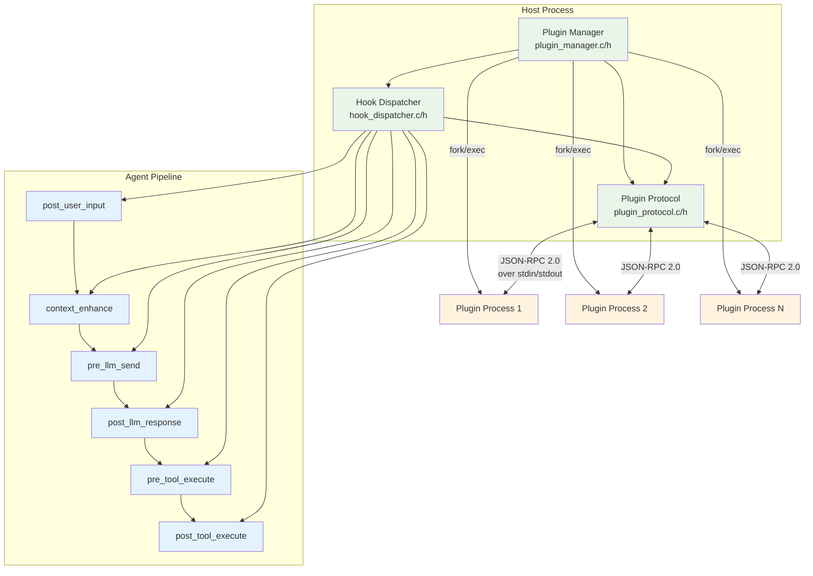

### Plugin Architecture

Three layers:

1. **Plugin Protocol** (`lib/plugin/plugin_protocol.c/h`) - JSON-RPC 2.0 message serialization for initialize, hook events, tool execution, and shutdown
2. **Plugin Manager** (`lib/plugin/plugin_manager.c/h`) - Directory scanning (rejects symlinks via `lstat`), process spawning via fork/pipe with O_CLOEXEC, handshake with name validation, tool registration (thread_safe=0 for serialized execution), crash detection via lazy `waitpid`, 10 MB response limit, and graceful shutdown (SIGTERM → wait → SIGKILL)
3. **Hook Dispatcher** (`lib/plugin/hook_dispatcher.c/h`) - Generic callback-driven dispatch: each hook defines a context struct, `build_params()` callback, and `apply_result()` callback. A single `hook_dispatch_generic()` loop handles subscriber ordering, event send/receive, response parsing, and STOP/SKIP/CONTINUE chain semantics

### Plugin Lifecycle

1. **Discovery**: Scan `~/.local/scaffold/plugins/` for executable files (skip hidden files and symlinks)
2. **Spawn**: Fork/exec each plugin, set up stdin/stdout pipes for bidirectional JSON-RPC
3. **Handshake**: Send `initialize` request, receive manifest (name, version, hooks, tools, priority). Plugin names are validated: must not contain underscores, forward slashes, or backslashes, must be 1-64 chars. Duplicate names are rejected (second plugin is killed)
4. **Tool Registration**: Plugin tools registered as `plugin_<pluginname>_<toolname>` in the ToolRegistry as schema-only entries (`execute_func=NULL`). Execution is dispatched explicitly by `tool_batch_executor.c` via `plugin_manager_execute_tool()`, following the same pattern as MCP tools. Classified as `GATE_CATEGORY_PLUGIN` (default: gated, requires approval)
5. **Runtime**: Hook dispatcher routes pipeline events to subscribed plugins via IPC. Crash detection via lazy `waitpid` before each request
6. **Shutdown**: Send `shutdown` request, SIGTERM, wait, SIGKILL if needed

### Hook Points

| Hook | Location | Purpose |
|------|----------|---------|
| `post_user_input` | `session.c` | Transform/filter user input |
| `context_enhance` | `streaming_handler.c`, `message_dispatcher.c` | Add dynamic context (git status, project info) |
| `pre_llm_send` | `streaming_handler.c`, `message_dispatcher.c` | Modify system prompt before LLM request (both streaming and buffered paths) |
| `post_llm_response` | `streaming_handler.c`, `message_processor.c` | Transform LLM response text (both streaming and buffered paths) |
| `pre_tool_execute` | `tool_batch_executor.c` | Intercept/block tool calls |
| `post_tool_execute` | `tool_batch_executor.c` | Transform tool results |

### Hook Dispatch Semantics

- Multiple plugins can subscribe to the same hook
- Plugins execute in priority order (lower priority number = runs earlier, default 500)
- `"action":"continue"` passes to the next plugin in the chain
- `"action":"stop"` halts the chain (pre_tool_execute returns a result, post_user_input discards)
- `"action":"skip"` discards the event (post_user_input only)
- Context enhance hooks always accumulate (stop/skip ignored)
- 5-second timeout per plugin response via `select()`
- 10 MB maximum response size per plugin message (OOM protection)
- Plugin tools are serialized (`thread_safe=0`) to prevent data races on shared IPC state

### Plugin Protocol

JSON-RPC 2.0 over stdin/stdout, newline-terminated messages. Same framing as MCP stdio transport.

- `initialize` → manifest (name, version, hooks, tools, priority)
- `hook/<hook_name>` → action + transformed data
- `tool/execute` → success + result
- `shutdown` → acknowledgment

Plugins can be written in any language that speaks the protocol (C, Python, Go, Rust, shell scripts).

## OAuth2 Authentication Architecture

The auth module (`lib/auth/`) enables OAuth2 login against OpenAI/ChatGPT subscription accounts, allowing CLI tools to use subscription-based models without a separate API key.

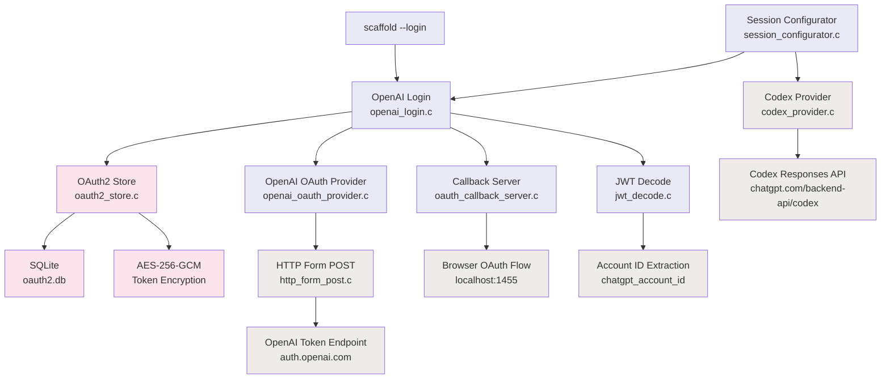

### Auth Flow
1. `scaffold --login` initiates OAuth2 Authorization Code + PKCE flow
2. Browser opens to OpenAI auth endpoint (or URL printed for headless environments)
3. Localhost callback server receives authorization code on port 1455
4. Code exchanged for access/refresh tokens via form-urlencoded POST
5. Tokens encrypted with AES-256-GCM and stored in `oauth2.db`
6. On API requests to Codex URL, session configurator retrieves credentials and registers a credential provider with `llm_client` for automatic token refresh
7. JWT decoded to extract `chatgpt_account_id` for request header
8. Refresh token rotation handled automatically via unified `refresh_token` vtable callback (provider sets `new_refresh_token` or leaves empty for non-rotating)

### Persistent Store & Session Refresh
- Module-level `g_store` in `openai_login.c` reuses the same `oauth2_store_t` across calls for the same db_path, avoiding repeated store creation/destruction
- `openai_refresh_credential()` is registered as a `llm_credential_provider_fn` callback with `llm_client_set_credential_provider()`, ensuring tokens are auto-refreshed before each LLM API request
- `openai_auth_cleanup()` destroys the persistent store at shutdown

### Codex Responses API
The Codex provider uses OpenAI's Responses API format (different from Chat Completions):
- Request: `instructions` (system prompt) + `input` (message array) + `tools` (flat format: `{type, name, description, parameters}`)
- Response: `output` array with `output_text` and `function_call` items
- Streaming: `response.output_text.delta`, `response.function_call_arguments.delta`, `response.failed`, `response.incomplete`, and `error` events
- Auth: `chatgpt-account-id` header alongside Bearer token
- Assistant messages with embedded `tool_calls` are summarized to plain text to avoid Responses API rejection

## Prompt Caching Architecture

System prompts are split into two parts to maximize cache hits across API requests within a session:

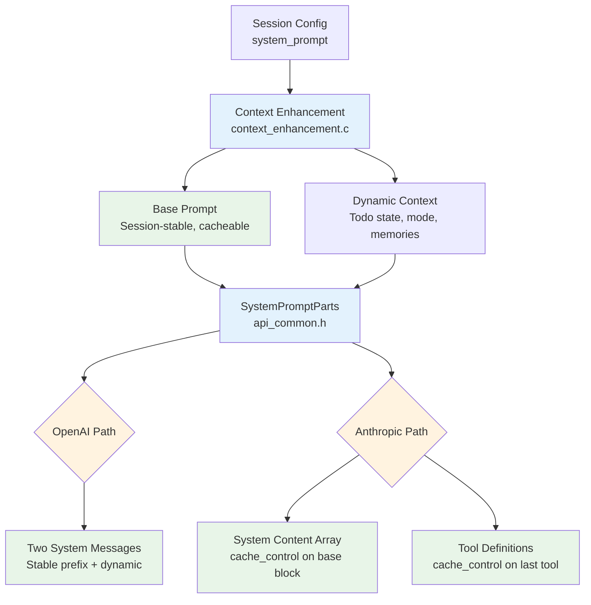

- **OpenAI**: Two system messages in the messages array. The first (base prompt) stays byte-identical across requests, enabling automatic prefix caching. The second carries per-request dynamic context.
- **Anthropic**: System field is a JSON array of content blocks. The base prompt block has `cache_control: {"type": "ephemeral"}` for explicit caching. The last tool definition also gets `cache_control` to cache the full tool schema. The `anthropic-beta: prompt-caching-2024-07-31` header is sent automatically by the Anthropic provider.
- **`SystemPromptParts`** (`api_common.h`): Carries the split through the pipeline. `base_prompt` is the session-stable prefix; `dynamic_context` is nullable per-request additions.
- **`EnhancedPromptParts`** (`context_enhancement.h`): Owned version with allocated strings, returned by `build_enhanced_prompt_parts()`.

## Streaming Response Architecture

Ralph supports Server-Sent Events (SSE) streaming for real-time response display.

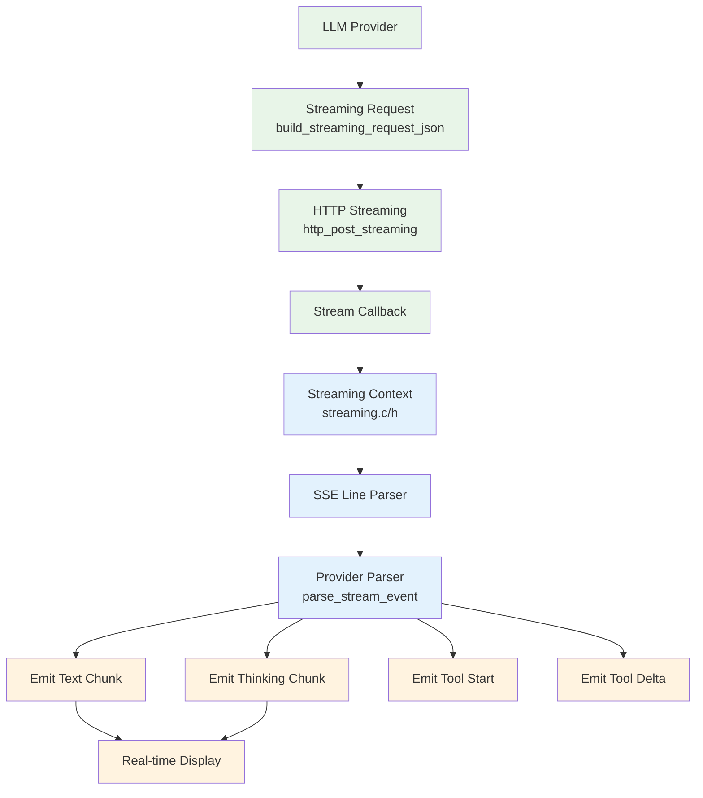

### Streaming Features
- Real-time text streaming to console
- Extended thinking content accumulation
- Tool call argument accumulation from deltas
- Provider-specific SSE parsing (Anthropic events vs OpenAI data lines)
- Configurable via `--no-stream` flag to disable

## Subagent System

Ralph can spawn child processes to execute tasks in parallel.

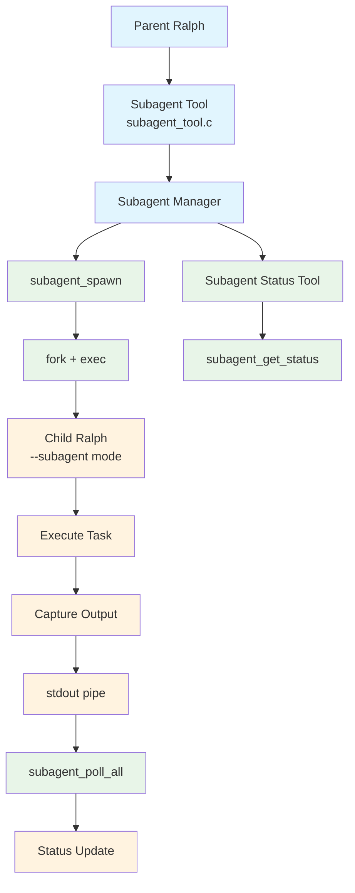

### Subagent Configuration
- `max_subagents`: Maximum concurrent subagents (default: 5)
- `subagent_timeout`: Timeout in seconds (default: 300)

### Subagent Tool Commands
- `subagent`: Spawn a new subagent with a task
- `subagent_status`: Query subagent status with optional blocking wait

## Inter-Agent Messaging System

Ralph supports inter-agent communication through a messaging system that enables parent-child and peer-to-peer agent communication.

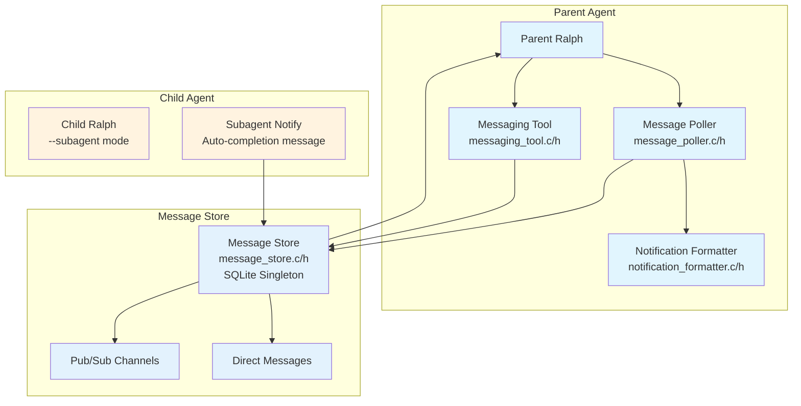

### Messaging Components

- **Message Store** (`message_store.c/h`): SQLite-backed singleton for persistent message storage
  - Direct messages between agents
  - Pub/sub channels for broadcast communication
  - Peek-then-consume API for non-destructive message inspection before processing
  - Automatic message expiry and cleanup
- **Message Poller** (`message_poller.c/h`): Background thread that polls for new messages
  - Uses PipeNotifier for integration with select/poll loops
  - Configurable poll interval
- **Notification Formatter** (`notification_formatter.c/h`): Formats messages for LLM context injection
- **Messaging Tool** (`messaging_tool.c/h`): Tool interface for agent messaging operations

### Messaging Tools
- `get_agent_info`: Get current agent ID and parent agent ID
- `send_message`: Send a direct message to another agent
- `check_messages`: Check for and receive pending messages
- `subscribe_channel`: Subscribe to a pub/sub channel
- `publish_channel`: Publish a message to a channel
- `check_channel_messages`: Receive messages from subscribed channels

### Automatic Subagent Notifications

When a subagent completes (success, failure, or timeout), the parent harness automatically sends a completion message to the parent agent. This eliminates the need for subagents to explicitly send messages back. The notification includes:
- Subagent ID and status
- Result or error message
- Original task description

Subagents do not have access to messaging tools - the parent harness handles all notification automatically.

## Approval Gate System

Ralph implements a comprehensive approval gate system that controls tool execution based on security categories and user preferences.

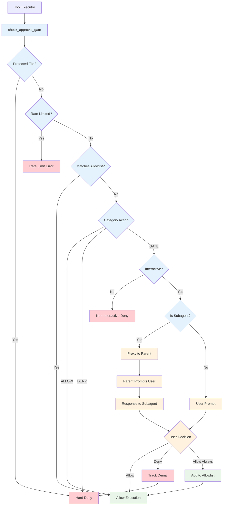

### Tool Categories

| Category | Default Action | Description |
|----------|---------------|-------------|
| `file_read` | ALLOW | File reading operations |
| `file_write` | GATE | File writing operations |
| `shell` | GATE | Shell command execution |
| `network` | GATE | Network requests |
| `memory` | ALLOW | Memory tool operations |
| `subagent` | GATE | Spawning subagents |
| `mcp` | GATE | MCP tool execution |
| `python` | ALLOW | Python code execution |
| `plugin` | GATE | Plugin tool execution |

### Key Components

- **Approval Gate** (`approval_gate.c/h`): Core orchestration logic for gate checking
- **Rate Limiter** (`rate_limiter.c/h`): Exponential backoff after repeated denials
- **Allowlist** (`allowlist.c/h`): Regex and shell command pattern matching
- **Gate Prompter** (`gate_prompter.c/h`): Terminal UI for user approval
- **Pattern Generator** (`pattern_generator.c/h`): Auto-generate allowlist patterns
- **Protected Files** (`protected_files.c/h`): Hard-block access to sensitive files
- **Shell Parser** (`shell_parser.c/h`): Cross-platform shell command parsing (POSIX/CMD/PowerShell)
- **Atomic File** (`atomic_file.c/h`): TOCTOU-safe file operations
- **Subagent Approval** (`subagent_approval.c/h`): IPC-based approval proxying for child processes

### CLI Flags

- `--yolo`: Disable all approval gates for the session
- `--allow "tool:pattern"`: Add entry to session allowlist
- `--allow-category=<category>`: Set category action to ALLOW

### Configuration

Gates are configured in `scaffold.config.json`:
```json
{
  "approval_gates": {
    "enabled": true,
    "categories": {
      "file_write": "gate",
      "shell": "gate",
      "network": "allow"
    },
    "allowlist": [
      {"tool": "shell", "pattern": ["git", "status"]}
    ]
  }
}
```

## CLI Commands

Interactive slash commands provide direct access to state inspection without LLM involvement. Commands are registered via `slash_commands.c`.

```mermaid
graph TB
    CLI[main.c<br/>Interactive Mode] --> CommandParser[Command Parser<br/>Slash commands]

    CommandParser --> MemoryCommands[Memory Commands<br/>lib/ui/memory_commands.c/h]

    MemoryCommands --> MemList[/memory list<br/>List chunks]
    MemoryCommands --> MemSearch[/memory search<br/>Search chunks]
    MemoryCommands --> MemShow[/memory show<br/>Show chunk details]
    MemoryCommands --> MemEdit[/memory edit<br/>Edit metadata]
    MemoryCommands --> MemIndices[/memory indices<br/>List indices]
    MemoryCommands --> MemStats[/memory stats<br/>Index statistics]

    MemList --> MetadataStore[Metadata Store]
    MemSearch --> MetadataStore
    MemShow --> MetadataStore
    MemEdit --> MetadataStore
    MemEdit --> VectorDB[Vector DB Service]
    MemEdit --> EmbeddingsService[Embeddings Service]
    MemIndices --> VectorDB
    MemStats --> VectorDB

    classDef cli fill:#e1f5fe
    classDef commands fill:#c8e6c9
    classDef services fill:#e3f2fd

    class CLI,CommandParser cli
    class MemoryCommands,MemList,MemSearch,MemShow,MemEdit,MemIndices,MemStats commands
    class MetadataStore,VectorDB,EmbeddingsService services
```

### Available Slash Commands
| Command | Arguments | Description |
|---------|-----------|-------------|
| `/memory help` | - | Display help message |
| `/memory list` | `[index_name]` | List chunks from index (default: long_term_memory) |
| `/memory search` | `<query>` | Search chunks by content/metadata |
| `/memory show` | `<chunk_id>` | Display full details of a chunk |
| `/memory edit` | `<chunk_id> <field> <value>` | Edit chunk metadata |
| `/memory indices` | - | List all available indices with stats |
| `/memory stats` | `[index_name]` | Show statistics for index |
| `/tasks` | `[subcommand]` | List/show tasks (`list`, `ready`, `show <id>`) |
| `/agents` | `[subcommand]` | List subagents and supervisors (`show <id>`) |
| `/model` | `[model_name]` | Switch AI models |
| `/mode` | `[mode_name]` | Switch behavioral prompt modes |
| `/goals` | `[subcommand]` | List GOAP goals, show details + action tree |
| `/plugins` | - | Show loaded plugins (name, version, PID, hooks, tools) |

## Embedding Provider Abstraction

The embedding system uses a parallel registry pattern to the LLM provider system.

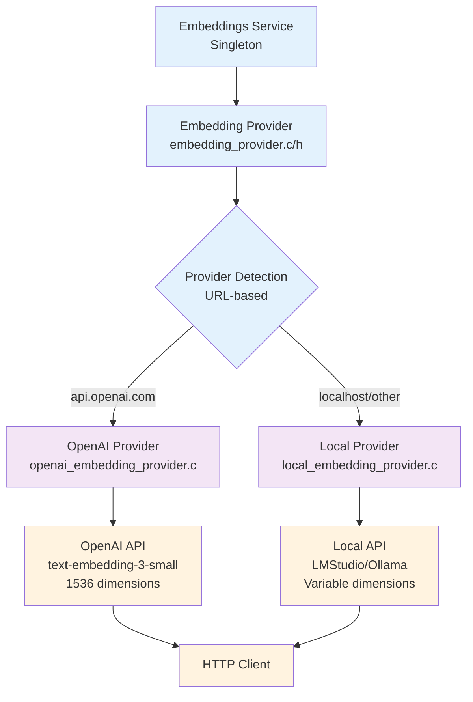

### Embedding Configuration
- **Separate API URL**: `embedding_api_url` can differ from `openai_api_url`
- **Model Selection**: Configurable via `embedding_model` setting
- **Known Dimensions**: text-embedding-3-small (1536), text-embedding-3-large (3072)
- **Local Models**: Supports Qwen3-Embedding, all-MiniLM, all-mpnet, and others

## Data Persistence Layer

Ralph uses a layered persistence architecture for semantic storage.

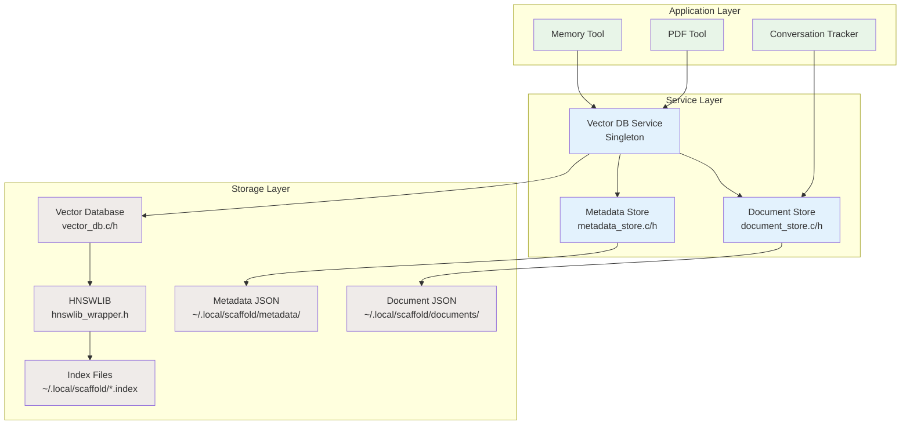

### Storage Locations
| Type | Path | Format |
|------|------|--------|
| Vector Indices | `~/.local/scaffold/*.index` | HNSWLIB binary |
| Index Metadata | `~/.local/scaffold/*.meta` | JSON |
| Documents | `~/.local/scaffold/documents/{index}/doc_{id}.json` | JSON |
| Chunk Metadata | `~/.local/scaffold/metadata/{index}/chunk_{id}.json` | JSON |

### Index Configurations
| Index Type | Max Elements | M | ef_construction | Use Case |
|------------|--------------|---|-----------------|----------|
| Memory | 100,000 | 16 | 200 | Long-term semantic memory |
| Documents | 10,000 | 16 | 200 | PDF and document storage |

## Key Features

- **Multi-Provider Support**: Seamlessly works with Anthropic, OpenAI, and local LLM servers
- **Extensible Tools**: Plugin architecture for adding new tools and capabilities
- **Approval Gates**: Category-based tool access control with user prompts, allowlists, and rate limiting
- **MCP Integration**: Model Context Protocol support for external tool servers (STDIO/HTTP/SSE)
- **Interactive CLI Commands**: Slash commands for direct memory management (`/memory`)
- **Conversation Persistence**: Automatic conversation tracking with vector database integration
- **Token Management**: Intelligent context window optimization and conversation compaction
- **Vector Database Integration**: Persistent semantic memory with HNSWLIB backend
- **Document Processing**: Automatic PDF extraction, chunking, and indexing
- **Dual Embedding Providers**: Support for OpenAI and local embedding services (LMStudio, Ollama)
- **Layered Persistence**: Document Store + Metadata Store for rich semantic storage
- **Long-term Memory System**: Semantic storage and retrieval of important information
- **Thread-Safe Services**: Concurrent access to vector databases with mutex protection
- **Centralized Configuration**: JSON config file with environment variable support
- **Portable**: Built with Cosmopolitan for universal binary compatibility
- **Memory Safe**: Defensive programming with comprehensive error handling
- **Testable**: Extensive test suite covering all major components including vector operations

## Tool Categories

### Memory Tools (3 tools)
- **`remember`**: Store information in long-term semantic memory
- **`recall_memories`**: Search and retrieve relevant memories using semantic similarity
- **`forget_memory`**: Delete a memory by ID

### PDF Processing Tools
- **`pdf_extract_text`**: Extract text from PDFs with configurable page ranges and output format

### Python Tools (1 tool + file-based tools)
- **`python`**: Execute arbitrary Python code with embedded interpreter

### Python File Tools (11 tools loaded from `~/.local/scaffold/tools/`)
- **`read_file`**: Read file contents with line numbers, returns dict with content/total_lines/range
- **`write_file`**: Write content to file
- **`append_file`**: Append content to file
- **`file_info`**: Get file metadata
- **`list_dir`**: List directory contents with ISO timestamps
- **`search_files`**: Search for patterns in files with optional context lines, returns matched_files and total_matches_found
- **`apply_delta`**: Apply delta patch operations with optional expected-content verification
- **`shell`**: Execute shell commands
- **`web_fetch`**: Fetch web content
- **`pip_install`**: Install pure-Python packages from PyPI (py3-none-any wheels only)
- **`pip_list`**: List installed Python packages from site-packages

### Subagent Tools (2 tools)
- **`subagent`**: Spawn a child ralph process for parallel task execution
- **`subagent_status`**: Query the status of a running subagent

### Messaging Tools (6 tools)
- **`get_agent_info`**: Get current agent ID and parent information
- **`send_message`**: Send a direct message to another agent
- **`check_messages`**: Check for and receive pending direct messages
- **`subscribe_channel`**: Subscribe to a pub/sub channel
- **`publish_channel`**: Publish a message to a channel
- **`check_channel_messages`**: Receive messages from subscribed channels

### Todo Tools (2 tools)
- **`TodoWrite`**: Create, update status/priority, delete, or bulk set todos
- **`TodoRead`**: List and filter todos by status and priority

### GOAP Tools (9 tools)
- **`goap_get_goal`**: Read goal details (description, goal state, world state, status)
- **`goap_list_actions`**: List actions for a goal, optionally filtered by status or parent
- **`goap_create_goal`**: Create a new goal with goal state assertions; optional `persistent` flag promotes to ACTIVE immediately
- **`goap_create_actions`**: Batch-create actions with preconditions and effects
- **`goap_update_action`**: Update action status and result
- **`goap_dispatch_action`**: Dispatch primitive action to worker (enqueue + spawn)
- **`goap_update_world_state`**: Merge boolean assertions into goal's world state; optional `summary` for progress notes
- **`goap_check_complete`**: Check if world_state satisfies goal_state
- **`goap_get_action_results`**: Read completed action results (truncated for context safety)

### Orchestrator Tools (6 tools)
- **`execute_plan`**: Decompose a plan into GOAP goals and actions with decomposition instructions
- **`list_goals`**: List all goals with status and world state progress
- **`goal_status`**: Detailed goal view (world state, action tree, supervisor info)
- **`start_goal`**: Activate a goal and spawn its supervisor process
- **`pause_goal`**: Pause a goal by stopping its supervisor
- **`cancel_goal`**: Cancel a goal by killing its supervisor

### Mode Tools (1 tool)
- **`switch_mode`**: Switch behavioral prompt mode (plan, explore, debug, review, default)

### Vector Database Tools (13 tools)
- **Index Management**: `vector_db_create_index`, `vector_db_delete_index`, `vector_db_list_indices`
- **Vector Operations**: `vector_db_add_vector`, `vector_db_update_vector`, `vector_db_delete_vector`, `vector_db_get_vector`
- **Search Operations**: `vector_db_search`, `vector_db_search_text`, `vector_db_search_by_time`
- **Text Operations**: `vector_db_add_text`, `vector_db_add_chunked_text`, `vector_db_add_pdf_document`

## Storage and Persistence

- **Default Storage Location**: `~/.local/scaffold/` for all vector database indices
- **Index Configuration**: Separate configurations for memory storage vs document storage
- **Thread Safety**: Mutex-protected singleton services for concurrent access
- **Automatic Initialization**: Services initialize automatically on first use
- **Rich Metadata**: Timestamps, content types, and classification for all stored vectors


## Directory Structure

```
src/
├── scaffold/               # Scaffold CLI (single binary)
│   └── main.c              # Entry point (REPL, one-shot, --supervisor, --worker, --check-update, --update)
├── tools/                  # Python tool integration
│   ├── python_tool.c/h     # Embedded Python interpreter
│   ├── python_tool_files.c/h # Python file-based tools
│   ├── python_extension.c/h  # Tool extension interface for Python
│   ├── http_python.c/h     # Python extension for C HTTP client (_ralph_http module)
│   ├── verified_file_python.c/h # Python extension for verified I/O
│   ├── sys_python.c/h      # Python extension for system info (_ralph_sys module)
│   └── python_defaults/    # Default Python tool files
│       ├── read_file.py
│       ├── write_file.py
│       ├── append_file.py
│       ├── file_info.py
│       ├── list_dir.py
│       ├── search_files.py
│       ├── apply_delta.py
│       ├── shell.py
│       ├── web_fetch.py
│       ├── pip_install.py
│       └── pip_list.py
lib/
├── libagent.h              # Public API for the agent library
├── types.h                 # Shared types (ToolCall, ToolResult, StreamingToolUse)
├── agent/                  # Agent abstraction and session management
│   ├── agent.c/h           # Agent lifecycle (init, run, cleanup)
│   ├── session.c/h         # Thin coordinator delegating to extracted modules
│   ├── session_configurator.c/h # Configuration loading and API type detection
│   ├── message_dispatcher.c/h  # Dispatch path selection (streaming vs buffered)
│   ├── message_processor.c/h   # Buffered response handling
│   ├── api_round_trip.c/h  # Single LLM request-response cycle
│   ├── conversation_state.c/h  # Conversation history append helpers
│   ├── tool_batch_executor.c/h # Batch tool execution with approval gates
│   ├── tool_orchestration.c/h  # Tool call deduplication and tracking
│   ├── repl.c/h            # Read-Eval-Print-Loop for interactive mode
│   ├── async_executor.c/h  # Non-blocking message processing thread
│   ├── context_enhancement.c/h  # Split prompt builder (base + dynamic context)
│   ├── recap.c/h           # Conversation recap generation
│   ├── streaming_handler.c/h   # Streaming orchestration layer
│   ├── tool_executor.c/h   # Tool execution entry point
│   ├── iterative_loop.c/h  # Iterative tool-calling loop
│   └── prompt_mode.c/h     # Behavioral prompt mode definitions (plan, explore, debug, review)
├── session/                # Session data management
│   ├── session_manager.c/h # Session data structures
│   ├── conversation_tracker.c/h # Conversation persistence
│   ├── token_manager.c/h   # Token counting/allocation
│   ├── conversation_compactor.c/h # Context trimming
│   └── rolling_summary.c/h # Rolling conversation summary generation
├── db/                     # Database layer
│   ├── vector_db.c/h       # Low-level HNSWLIB wrapper
│   ├── vector_db_service.c/h # Thread-safe singleton service
│   ├── document_store.c/h  # High-level document storage
│   ├── metadata_store.c/h  # Chunk metadata storage
│   ├── task_store.c/h      # SQLite-based persistent task storage
│   ├── goal_store.c/h      # GOAP goal persistence (scaffold orchestration)
│   ├── action_store.c/h    # GOAP action persistence with hierarchy, readiness queries, and work_item_id correlation
│   ├── oauth2_store.c/h    # OAuth2 token management with PKCE, AES-256-GCM encryption, provider vtable
│   ├── sqlite_dal.c/h      # SQLite data access layer (ref-counted, recursive mutex for nested locking)
│   └── hnswlib_wrapper.cpp/h # C++ bridge
├── llm/                    # LLM core framework
│   ├── llm_provider.c/h    # Provider abstraction layer
│   ├── model_capabilities.c/h # Model capability detection
│   ├── embeddings.c/h      # Low-level embeddings API
│   ├── embedding_provider.c/h # Embedding provider abstraction
│   ├── embeddings_service.c/h # Embeddings singleton service
│   ├── llm_client.c/h      # LLM HTTP client (accepts provider-built headers)
│   ├── models/             # Model capability implementations
│   │   ├── model_registry.c     # Data-driven model registration
│   │   ├── claude_model.c       # Claude format function
│   │   ├── gpt_model.c          # GPT format function
│   │   └── response_processing.c/h  # Thinking tag processing
│   └── providers/          # API provider implementations
│       ├── anthropic_provider.c  # Anthropic API client
│       ├── openai_provider.c     # OpenAI API client
│       ├── local_ai_provider.c   # Local AI server integration
│       ├── openai_embedding_provider.c  # OpenAI embeddings
│       └── local_embedding_provider.c   # Local embeddings
├── network/                # Network layer
│   ├── http_client.c/h     # HTTP client (cURL wrapper)
│   ├── api_common.c/h      # API payload building with prompt caching support
│   ├── streaming.c/h       # SSE streaming infrastructure
│   ├── api_error.c/h       # Enhanced error handling with retries
│   ├── embedded_cacert.c/h # Embedded Mozilla CA certificate bundle
│   └── image_attachment.c/h # Image attachment parsing (@path to base64)
├── policy/                 # Approval gate system
│   ├── approval_gate.c/h   # Core approval orchestration
│   ├── allowlist.c/h       # Pattern matching allowlist
│   ├── rate_limiter.c/h    # Denial rate limiting
│   ├── gate_prompter.c/h   # Terminal UI prompts
│   ├── pattern_generator.c/h # Auto-generate patterns
│   ├── tool_args.c/h       # Tool argument extraction
│   ├── protected_files.c/h # Protected file detection
│   ├── path_normalize.c/h  # Cross-platform path normalization
│   ├── shell_parser.c/h    # POSIX shell parsing
│   ├── shell_parser_cmd.c  # cmd.exe parsing
│   ├── shell_parser_ps.c   # PowerShell parsing
│   ├── atomic_file.c/h     # TOCTOU-safe file operations
│   ├── subagent_approval.c/h # Subagent approval proxy
│   ├── approval_errors.c   # Approval gate error formatting
│   ├── verified_file_context.c/h # Thread-local verified file context
│   └── verified_file_python.c/h  # Python extension for verified I/O
├── plugin/                 # Plugin system
│   ├── plugin_manager.c/h  # Plugin discovery, spawning, lifecycle, IPC
│   ├── plugin_protocol.c/h # JSON-RPC 2.0 protocol serialization
│   └── hook_dispatcher.c/h # Hook event routing to subscribed plugins
├── mcp/                    # Model Context Protocol
│   ├── mcp_client.c/h      # MCP client implementation
│   ├── mcp_transport.c/h   # Transport abstraction layer
│   ├── mcp_transport_stdio.c   # STDIO transport implementation
│   └── mcp_transport_http.c    # HTTP transport implementation
├── pdf/                    # PDF processing
│   └── pdf_extractor.c/h   # PDFio-based text extraction
├── ipc/                    # Inter-process communication
│   ├── ipc.h               # Public IPC API header
│   ├── pipe_notifier.c/h   # Thread-safe pipe-based notification
│   ├── agent_identity.c/h  # Thread-safe agent identity management
│   ├── message_store.c/h   # SQLite-backed direct and pub/sub messaging
│   ├── message_poller.c/h  # Background message polling
│   └── notification_formatter.c/h # LLM notification formatting
├── ui/                     # User interface components
│   ├── ui.h                # Public UI API header
│   ├── output.h            # Output formatting header
│   ├── terminal.c/h        # Terminal abstraction
│   ├── spinner.c/h         # Tool execution spinner feedback
│   ├── output_formatter.c/h # Response formatting
│   ├── json_output.c/h     # JSON output mode
│   ├── slash_commands.c/h  # Slash command registry and dispatch
│   ├── memory_commands.c/h # /memory slash commands
│   ├── task_commands.c/h   # /tasks slash commands
│   ├── agent_commands.c/h  # /agents slash commands (subagents + supervisors)
│   ├── goal_commands.c/h   # /goals slash commands
│   ├── model_commands.c/h  # /model slash commands
│   ├── mode_commands.c/h   # /mode slash commands
│   └── status_line.c/h     # Status info line (tokens, agents, mode, busy state)
├── tools/                  # Tool system
│   ├── tools.h             # Public tools API header
│   ├── tools_system.c/h    # Tool registry and execution
│   ├── tool_result_builder.c/h # Result formatting
│   ├── tool_param_dsl.c/h  # Table-driven parameter DSL
│   ├── tool_format.h       # Tool format strategy pattern
│   ├── tool_format_anthropic.c # Anthropic tool format
│   ├── tool_format_openai.c    # OpenAI tool format
│   ├── tool_extension.c/h  # Extension interface for external tools
│   ├── builtin_tools.c/h   # Built-in tool registration
│   ├── memory_tool.c/h     # Semantic memory (remember, recall_memories, forget_memory)
│   ├── pdf_tool.c/h        # PDF processing tool
│   ├── vector_db_tool.c/h  # Vector DB operations (13 tools)
│   ├── subagent_tool.c/h   # Subagent process spawning
│   ├── subagent_process.c/h    # Subagent I/O and lifecycle
│   ├── messaging_tool.c/h  # Inter-agent messaging (6 tools)
│   ├── goap_tools.c/h      # GOAP goal/action tools for supervisors (9 tools, scaffold only)
│   ├── orchestrator_tool.c/h # Orchestrator lifecycle tools (6 tools, scaffold only)
│   ├── mode_tool.c/h       # LLM-callable switch_mode tool
│   ├── tool_cache.c/h      # Thread-safe tool result caching with file mtime invalidation
│   ├── todo_manager.c/h    # Todo data structures
│   ├── todo_tool.c/h       # Todo tool call handler
│   └── todo_display.c/h    # Todo visualization
├── services/               # Service container
│   └── services.c/h        # Dependency injection container
├── util/                   # Generic utilities
│   ├── darray.h            # Type-safe dynamic array macros
│   ├── ptrarray.h          # Type-safe dynamic pointer array with ownership
│   ├── uuid_utils.c/h      # UUID v4 generation and validation
│   ├── interrupt.c/h       # Cooperative Ctrl+C cancellation handling
│   ├── common_utils.c/h    # General utilities
│   ├── json_escape.c/h     # JSON escaping
│   ├── debug_output.c/h    # Debug logging
│   ├── document_chunker.c/h # Text chunking
│   ├── config.c/h          # Configuration management
│   ├── prompt_loader.c/h   # System prompt loading
│   ├── context_retriever.c/h # Vector context retrieval
│   ├── ansi_codes.h        # Terminal color codes and box-drawing characters
│   ├── app_home.c/h        # Centralized home directory management
│   ├── process_spawn.c/h  # Common fork/exec with stdout/stderr to /dev/null
│   └── executable_path.c/h # Executable path resolution for APE binaries
├── updater/               # Self-update system
│   └── updater.c/h        # GitHub releases check, download, and apply
├── orchestrator/          # Scaffold orchestration layer
│   ├── supervisor.c/h     # Supervisor event loop (GOAP tool-driven goal progression, orphaned action recovery)
│   ├── orchestrator.c/h   # Supervisor spawning (via process_spawn), monitoring, stale-PID cleanup (dead-only), and lifecycle
│   ├── goap_state.c/h     # Shared GOAP state evaluation (precondition checking, progress tracking)
│   └── role_prompts.c/h   # Role-based system prompts for workers (file override + built-in defaults)
└── workflow/               # Task queue
    └── workflow.c/h        # SQLite-backed work queue (workers spawned via subagent system)
```
